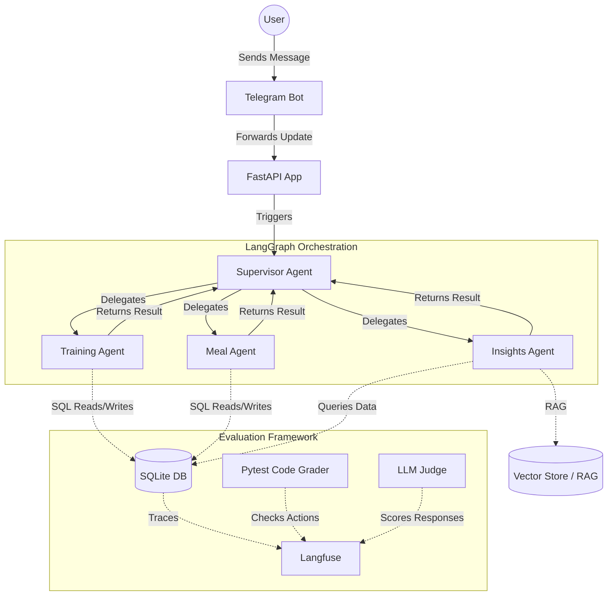

# Quality

You MUST spawn a subagent to run the verification following the instruction in @docs/quality.md before concluding your job done.

If your subagent reports back any error, failure, warning, you will fix it.

Repeat until your code passes subagent's verification then conclude your job as done.

# Architecture

The system follows a multi-agent orchestration pattern using LangGraph, persisting data locally in SQLite, and tracking agent trajectories via Langfuse.

