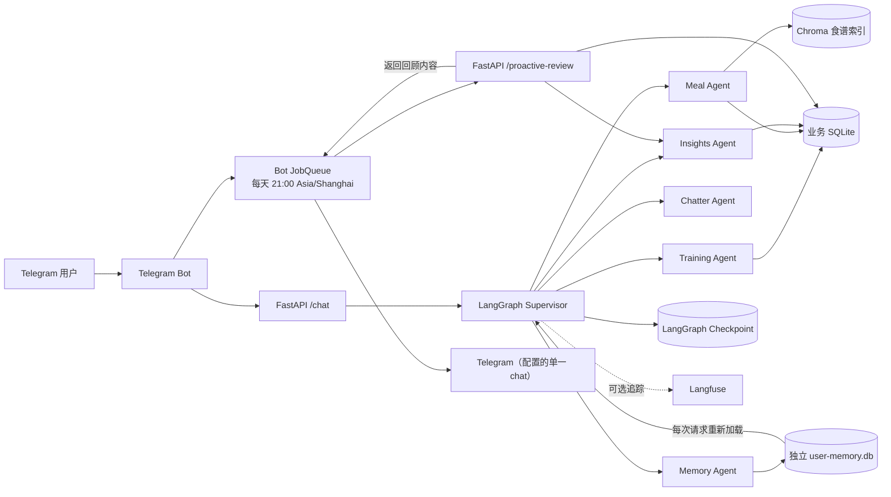

# ChatFit

ChatFit 是一个基于自然语言交互的个人训练与饮食助手。用户可以通过 Telegram
记录训练、饮食和身体感受，并让 Agent 分析训练量、恢复情况与饮食习惯。

项目使用 FastAPI 提供服务接口，使用 LangGraph 编排多个专业 Agent，并将业务数据、
对话检查点、长期用户记忆和食谱向量索引按不同职责持久化到本地。

## 核心能力

- 通过自然语言记录力量、耐力、距离和自重训练
- 记录早餐、午餐、晚餐、加餐及备注
- Telegram 当前支持文字、语音和 OCR 辅助图片输入
- 分析训练量、训练频率、RPE 和恢复趋势
- 基于本地食谱向量库提供饮食相关上下文
- Supervisor 根据对话内容并行路由 Training、Meal、Insights 和 Chatter Agent
- 数据写入前支持 Human-in-the-loop 确认
- 如果确认回复同时补充或修改了训练信息，ChatFit 不会立即写入；它会更新待保存内容并再次请求确认。确认后的重复投递使用幂等键，不会生成重复训练记录。
- 长对话自动压缩历史上下文，保留重要训练和饮食信息
- 支持用户显式记住、更新和忘掉长期偏好；目标不明确时先澄清，不会猜测后写入
- 支持 Google、OpenAI、Anthropic 以及 OpenAI-compatible 本地模型
- 可选接入 Langfuse 进行 Agent 链路追踪和质量评估
- 使用脱敏的结构化 trace 重建 Agent、LLM、工具、HITL 和 checkpoint 执行路径

## 架构概览



| 组件 | 职责 |
| --- | --- |
| Telegram Bot | 接收用户消息、渲染 Markdown、调用后端 API |
| FastAPI | 提供聊天与上下文管理接口，初始化 Agent Graph |
| Supervisor | 根据当前消息和历史上下文选择一个或多个专业 Agent |
| Training Agent | 解析并保存训练动作、组数、重量、次数、距离和 RPE |
| Meal Agent | 保存饮食记录，并检索本地食谱上下文 |
| Insights Agent | 聚合训练与饮食数据，生成趋势和恢复分析 |
| Memory Agent | 处理明确的记住、更新、忘掉命令；歧义或信息不全时先询问 |
| 主动回顾任务 | Bot JobQueue 在每天 21:00（Asia/Shanghai）调用 `/proactive-review`；API 查询 SQLite，并在周六调用 Insights Agent 汇总，随后由 Bot 发送 Telegram |
| Context Governance | 压缩过长的短期对话历史；不负责长期记忆的增删改 |
| Langfuse | 可选的运行轨迹、评分与生产质量观测 |

更完整的设计参见 [系统架构](docs/architecture.md)。

## 快速开始

### 前置条件

- Docker Compose 或 Podman Compose
- 一个由 [BotFather](https://t.me/BotFather) 创建的 Telegram Bot Token
- Google Gemini API Key（当前 API 默认使用 Google Provider）
- API 与 Bot 共享的独立随机 `CHATFIT_API_TOKEN`
- 可选：本地 SOCKS5 代理和 Langfuse 账号

### 1. 配置环境变量

```bash
cp .env.example .env
```

编辑 `.env`，至少设置：

```dotenv
GOOGLE_API_KEY=your-google-api-key
TELEGRAM_BOT_TOKEN=your-telegram-bot-token
CHATFIT_API_TOKEN=replace-with-an-independent-random-secret
```

Compose 会通过 `env_file` 把 `.env` 注入 API 与 Bot 容器。编辑 `.env` 不会让直接在
宿主机启动的 `api.py` 自动加载这些变量；宿主机命令需要先 `source`/`export`，或使用
明确支持 env file 的启动器参数。

常用可选配置：

| 变量 | 说明 |
| --- | --- |
| `TELEGRAM_PROXY` | Telegram Bot 使用的 SOCKS5 代理 |
| `LLM_PROXY` | LLM 请求使用的代理 |
| `LANGFUSE_HOST` | Langfuse 服务地址 |
| `LANGFUSE_PUBLIC_KEY` | Langfuse Public Key |
| `LANGFUSE_SECRET_KEY` | Langfuse Secret Key |
| `LANGFUSE_CAPTURE_CONTENT` | 是否允许 Langfuse 保存 prompt/output；默认 `false` |
| `CHATFIT_API_TOKEN` | 必填；Bot 与 API 共用的 Bearer 凭据，不要复用 Telegram 或 LLM token |
| `CHECKPOINTER_DB_PATH` | LangGraph checkpoint SQLite 文件路径 |
| `TZ` | API/Bot 容器的本地时区，用于未明确指定日期的训练和饮食记录；默认 `Asia/Shanghai`，应使用 IANA 时区名称 |
| `USER_MEMORY_DB_PATH` | 长期用户记忆 SQLite 文件；容器默认 `/app/data/user-memory.db` |
| `OBSERVABILITY_HASH_KEY` | 对用户标识和敏感内容生成稳定 keyed hash 的随机密钥 |
| `PROACTIVE_REVIEWS_ENABLED` | 是否启用每日/每周 Telegram 主动回顾；默认 `false` |
| `TELEGRAM_CHAT_ID` | 启用主动回顾时必填的整数 Telegram chat ID；关闭时不需要设置 |

#### 可选：启用主动回顾

主动回顾默认关闭。若要启用，请在 `.env` 中设置开关和接收消息的**整数**
chat ID：

```dotenv
PROACTIVE_REVIEWS_ENABLED=true
TELEGRAM_CHAT_ID=123456789
```

Bot 的 JobQueue 每天在 `21:00 Asia/Shanghai` 运行一次：当天只记录了饮食时，
提醒补充训练；只记录了训练时，提醒补充饮食；两类记录都没有时，提醒记录当天
饮食和训练；两类都有时不发送每日提醒。周六则只发送一条合并消息：由 Insights
Agent 生成当周周日至周六的总结，并附上当天仍缺失的类别提醒（如有）。

任务不会补发错过的时间点；重启或停机期间的提醒也不会追赶。当前实现只支持将
主动消息发送到一个配置的 chat ID，适用于单用户部署。

Langfuse 是可选依赖。Tracing 初始化或导出失败时，系统会记录日志并自动降级，
不会让 `/chat` 接口返回 500。

### 2. 配置本地数据目录

`docker-compose.yml` 默认挂载：

- `~/.iron`：业务 SQLite 数据库
- `./chroma.db`：食谱向量索引
- `./runtime-data`：LangGraph 对话 checkpoint 和与其分离的 `user-memory.db`
- `~/Documents/LifeOS/下厨房/`：本地食谱 Markdown 文件

如果你的目录不同，请修改 Compose 文件中的 volume 路径。Checkpoint 应挂载目录
`runtime-data/`，不要把一个不存在的宿主机文件直接绑定到
`/app/data/checkpointer.db`，否则容器运行时可能将其创建成目录。
`/app/data/user-memory.db` 是容器内路径；宿主机直接运行时应使用项目内或其他宿主机
可写路径。

### 3. 启动服务

```bash
docker compose up -d --build
```

使用 Podman：

```bash
podman-compose up -d --build
```

容器通过 `.env` 中的 `TZ` 计算本地日期。修改时请使用 IANA 时区名称（例如
`Asia/Shanghai`、`Europe/Berlin`），然后必须重新创建 API 与 Bot 容器；普通的
`restart` 不会应用环境变量变更。

使用 Docker Compose 重新创建：

```bash
docker compose up -d --force-recreate api bot
```

使用 Podman Compose 重新创建：

```bash
podman-compose up -d --force-recreate api bot
```

API 默认监听 `http://localhost:8000`，交互式接口文档位于
`http://localhost:8000/docs`。

检查运行状态和日志：

```bash
docker compose ps
docker compose logs -f api bot
```

### 4. 验证聊天接口

```bash
set -a
source .env
set +a
if [ -z "${CHATFIT_API_TOKEN:-}" ]; then
  echo "CHATFIT_API_TOKEN is required; set it in .env." >&2
else
  curl -X POST http://localhost:8000/chat \
    -H "Authorization: Bearer $CHATFIT_API_TOKEN" \
    -H 'Content-Type: application/json' \
    -d '{"user_id":"readme-smoke-test","message":"你好"}'
fi
```

成功响应示例：

```json
{
  "response": "你好！我是 ChatFit，你可以告诉我今天的训练或饮食。",
  "pending_tools": null
}
```

## API

`/chat` 和 `/clear` 是 Bot 调用的受信后端接口，必须携带
`Authorization: Bearer <CHATFIT_API_TOKEN>`。API 和 Bot 必须配置同一个值；缺失或
格式错误的 Bearer 凭据返回 `401`，值不匹配返回 `403`。API 启动时若未配置该变量
会直接失败，避免接受调用方伪造的 `user_id`。

### `POST /chat`

向 Agent Graph 发送一轮用户消息。同一个 `user_id` 会复用当前 thread 上下文。

请求：

```json
{
  "user_id": "telegram-user-id",
  "message": "今天跑了 5 公里，用时 30 分钟"
}
```

响应：

```json
{
  "response": "准备保存本次跑步记录，请确认。",
  "pending_tools": null
}
```

### `POST /clear`

为指定用户创建新的 thread，清除当前短期会话上下文；已保存的训练、饮食和长期
用户记忆都不会被删除。

请求：

```json
{
  "user_id": "telegram-user-id",
  "message": "/clear"
}
```

完整 OpenAPI Schema 可在服务启动后访问 `/openapi.json`。
每次 `/chat` 响应还会返回 `X-Request-ID` 和 `X-Trace-ID`，用于关联日志与 trace。

## 本地开发

项目要求 Python 3.13+，依赖通过 [uv](https://docs.astral.sh/uv/) 管理。

```bash
uv sync --dev
set -a
source .env
set +a
if [ -z "${GOOGLE_API_KEY:-}" ] || [ -z "${CHATFIT_API_TOKEN:-}" ]; then
  echo "GOOGLE_API_KEY and CHATFIT_API_TOKEN must both be set in .env." >&2
else
  mkdir -p runtime-data
  export CHECKPOINTER_DB_PATH=./runtime-data/checkpointer.db
  export USER_MEMORY_DB_PATH=./runtime-data/user-memory.db
  uv run uvicorn api:app --reload
fi
```

也可以运行终端交互版本：

```bash
uv run python main.py
```

### 代码质量与测试

```bash
# Ruff、Black、MyPy、Bandit
make quality

# 默认测试集；自动排除 e2e
make verify

# 单独运行 API 回归测试
uv run pytest tests/test_api.py -v

# 显式运行端到端测试
uv run pytest -m e2e -v
```

默认测试配置会排除标记为 `e2e` 的用例，避免普通验证意外调用外部 LLM、
Langfuse 或 Telegram 服务。质量规范参见 [质量与验证](docs/quality.md)。

## Agent Evaluation (Agent 能力评测)

ChatFit 采用了一套“测试即文档”的严谨评测架构，实现了工程代码与业务评测用例的完全解耦。

1. **唯一数据源 (JSONL Golden Test Set)**：
   测试用例维护在 `evaluation/chatfit_golden_test_set.jsonl` 中。每一条 Case 严格定义了用户的输入（`user_input`）、期望的确定性轨迹（`expected_trajectory_eval`）以及基于场景动态配置的裁判打分基准（`rubrics`）。

2. **多维动态 Rubric LLM-as-a-Judge**：
   摒弃硬编码，根据用例场景在 JSONL 中动态分配 7 大核心维度的权重进行 LLM 裁判打分：
   * 多轮上下文一致性 (Multi-turn Context Consistency)
   * 任务完成率 (Task Completion Rate)
   * 工具选择 (Tool Selection)
   * 轨迹合理性 (Trajectory Rationality)
   * 澄清能力 (Clarification Capability)
   * 安全边界 (Safety Boundaries)
   * 交互质量 (Interaction Quality)

3. **四大量化指标与门禁 (Release Gate Scorecard)**：
   评测引擎会根据生成的 `Trajectory` 和 Judge 分数，聚合产出四大核心量化指标：
   * **TCR (任务完成率)**：成功闭环的用例占比。
   * **TA (工具与参数准确率)**：精准阻断幻觉参数的工具调用率。
   * **CCR (上下文一致性)**：多轮与跨域记忆的接力通过率。
   * **ERR (异常恢复率)**：面对模糊意图的主动澄清或拒绝能力。
   最终在终端与 `evaluation/latest_report.md` 中输出报告，门禁拦截失败时返回非零退出码。

```bash
# 启动真实的 LLM 和 Agent Graph 跑通 43 条全量测试集，并生成评估报告
make eval

# 极速/本地调试模式 (高并发，关闭 LLM Judge 打分)
uv run python evaluation/runner.py --concurrency 10 --no-judge
```


## 数据与上下文

ChatFit 将不同类型的数据分开保存：

- **业务数据**：训练动作、训练组和饮食记录，默认位于 `~/.iron/iron.db`
- **Thread 上下文**：LangGraph 消息与执行 checkpoint，位于
  `runtime-data/checkpointer.db`
- **压缩摘要**：长对话中的重要上下文，作为 LangGraph state 的一部分持久化
- **长期用户记忆**：只有明确记住命令授权的偏好、约束、模板或资料，位于独立的
  `USER_MEMORY_DB_PATH`（容器默认 `/app/data/user-memory.db`）
- **RAG 数据**：从本地食谱生成的 Chroma 向量索引，位于 `chroma.db/`
- **主动回顾**：Bot JobQueue 调用 `/proactive-review`，API 从 SQLite 读取当天
  记录；周六再通过 Insights Agent 生成周日至周六总结，随后由 Bot 发送至配置的
  Telegram chat。

这四类状态用途不同：压缩摘要是当前 thread 的短期、可丢失对话提示；checkpoint
保存该 thread 的消息和执行状态；业务数据库保存训练与饮食事实；长期记忆保存用户
明确要求跨 thread 保留的信息。长期记忆会在每次请求从数据库重新读取，因此新
thread、`/clear` 和 API 重启后仍可使用；`/clear` 只切换当前用户的 thread，不会
删除业务数据、长期记忆或向量索引。

### 显式长期记忆

当前只为明确命令提供确定性授权边界，例如：

- `记住我乳糖不耐受` 或 `我不吃香菜，记下来`
- `把 2-1-3 模板更新成……`
- `忘掉乳糖不耐受`

ChatFit 不会把普通聊天自动推断为长期记忆，也不保证任意自然语言改写都能触发
记忆操作。内容或目标缺失、没有精确匹配、可能匹配多条时会先澄清，确认前数据库
不变。明确更新或忘掉命令若通过别名精确命中当前用户的一条长期记忆，会确定性进入
Memory Agent，不依赖概率路由器的选择；澄清回复仍必须与原操作、目标及缺失字段一致。
保存时保留用户明确给出的原文；每条记录由
`(owner, memory_type, canonical_key)` 唯一标识，并可有多个别名。更新会修改同一行、
保留其 ID 并递增版本；忘掉会物理删除该行及其别名。

本地 CLI 使用固定 owner `local-cli`，所以在同一个 `USER_MEMORY_DB_PATH` 上重启 CLI
仍可读取其记忆。Evaluation Runner 则为每个 case 创建独立的业务数据库和
`user-memory.db`，同一 case 的 turns 共享 case identity，不同 case 互不污染。

### 迁移已有的 2-1-3 模板

迁移脚本默认 dry-run，只读扫描业务数据库，不会修改来源文件：

```bash
uv run python scripts/migrate_explicit_memories.py \
  --source-db ~/.iron/iron.db \
  --memory-db runtime-data/user-memory.db \
  --user-id '<telegram-user-id>'
```

确认输出后增加 `--apply`：

```bash
uv run python scripts/migrate_explicit_memories.py \
  --source-db ~/.iron/iron.db \
  --memory-db runtime-data/user-memory.db \
  --user-id '<telegram-user-id>' \
  --apply
```

执行 apply 前，目标文件的直接父目录必须已经存在。脚本只迁移带明确记忆标记、且
完整匹配已批准 2-1-3 定义（抓举、挺举、长循环、三分钟左右/双手安排、波比跳和
thruster）的记录；其他候选只报告、不导入。重复执行会按唯一键对同一行做幂等
reconcile，不会创建重复记忆。只有目标内容完全相同时才会修复显示名称和别名；若
同一目标已有不同内容或待迁移别名已属于另一条记忆，dry-run 与 apply 都会以非零
状态报告冲突且保留原数据。目标存在 WAL、SHM 或 journal sidecar 时，dry-run 也会
fail closed；请先 checkpoint 并关闭写入者，再执行兼容性检查或 apply。

## 项目结构

```text
ChatFit/
├── agents/
│   ├── roles/              # Supervisor 与专业 Agent
│   ├── memory/             # 独立长期记忆 Agent、模型与 SQLite store
│   ├── llm_factory.py      # LLM Provider 工厂
│   ├── models.py           # Agent State 与业务模型
│   ├── rag.py              # 食谱检索与向量库
│   └── sqlite_handler.py   # 业务数据访问
├── config/                 # 同义词等运行配置
├── docs/                   # 架构、质量与设计文档
├── evaluation/             # JSONL测试集、动态Rubric、Runner与评分器
├── scripts/                # 运维脚本
├── tests/                  # 工程质量(单元与API测试，与Agent能力评测解耦)
├── api.py                  # FastAPI 服务
├── bot.py                  # Telegram Bot
├── main.py                 # 本地终端入口
├── docker-compose.yml      # API 与 Bot 容器编排
├── Dockerfile
└── Makefile
```

## 文档

- [系统架构](docs/architecture.md)
- [Agent Evaluation 设计](docs/evaluation.md)
- [Agent 可观测性设计](docs/observability.md)
- [质量与验证](docs/quality.md)
- [早期 Evaluation Framework Spec](docs/superpowers/specs/2026-07-11-agent-evaluation-framework-design.md)
- [Agent Verification Pipeline 设计](docs/superpowers/specs/2026-07-16-agent-verification-pipeline-design.md)

## Roadmap

- 将 LLM Provider 和模型选择完全配置化
- 增加容器健康检查与生产就绪探针
- 支持更多消息入口，例如微信
- 扩展训练、营养和恢复指标
