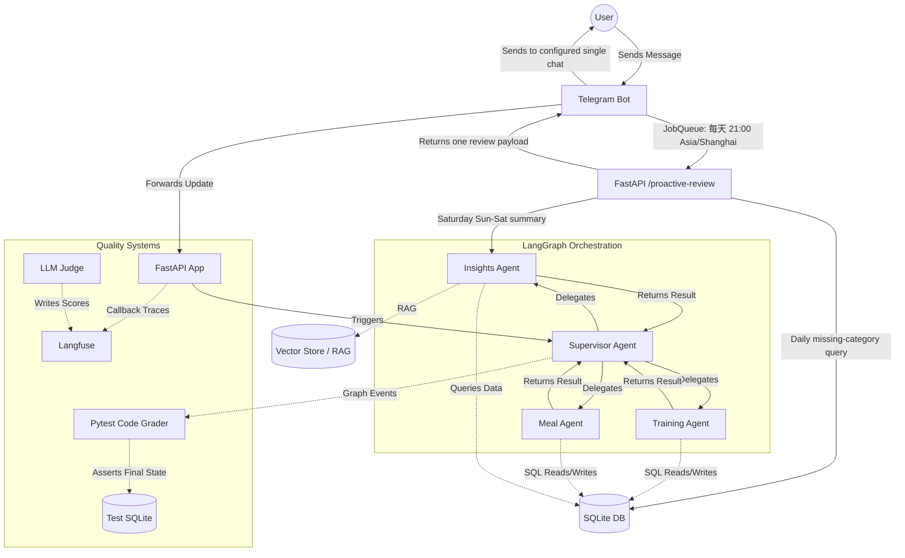

# ChatFit Architecture

The system follows a multi-agent orchestration pattern using LangGraph, persists
business data and conversation checkpoints locally, and optionally exports Agent
trajectories to Langfuse.

## Cross-cutting designs

- [Agent Evaluation](evaluation.md) defines datasets, graders, quality metrics,
  release gates, and the production feedback loop.
- [Agent Observability](observability.md) defines trace identity, span hierarchy,
  execution-path instrumentation, metrics, alerts, and privacy controls.
- [Quality and Verification](quality.md) defines the local static-analysis and
  test gates.

Evaluation and observability share the same correlation model. A test or
production request is represented by one `trace_id`; related turns share a
`session_id/thread_id`; evaluation traffic also carries a `run_id` and
`case_id`. Observability records what happened, while Evaluation decides whether
that behavior was acceptable.

## 可选主动回顾

主动 Telegram 回顾默认关闭。单用户部署可在 `.env` 中设置
`PROACTIVE_REVIEWS_ENABLED=true`，并提供一个整数 `TELEGRAM_CHAT_ID`；只有启用时
才要求该 chat ID。Bot 容器通过 `API_PROACTIVE_REVIEW_URL` 调用 API 容器内的
`http://api:8000/proactive-review`。

| 配置 | 默认值/要求 | 作用 |
| --- | --- | --- |
| `PROACTIVE_REVIEWS_ENABLED` | `false` | 开启 Bot JobQueue 的每日/每周回顾 |
| `TELEGRAM_CHAT_ID` | 仅启用时必填，且必须为整数 | 主动消息的唯一接收 chat；当前不支持多用户路由 |
| `API_PROACTIVE_REVIEW_URL` | `http://api:8000/proactive-review`（Bot 容器） | JobQueue 请求的内部 API 地址 |

JobQueue 每天在 `21:00 Asia/Shanghai` 触发一次，未运行期间不会补发。API 使用
SQLite 的当天训练和饮食记录判断是否需要每日提示：只记录饮食时提示补训练，只记录
训练时提示补饮食，两类都没有时同时询问当天饮食和训练，两类齐全时不发消息。周六只生成并
发送一条合并回顾：Insights Agent 汇总当周周日至周六的数据，并在有缺失类别时附加
当天提醒。该流程不会建立 catch-up 队列，也不为多个 Telegram chat 分发消息。

The backend-neutral signal envelope and fail-open sinks live in
`agents/observability.py`. Versioned datasets, deterministic graders, and release
scorecards live under `evaluation/`.
