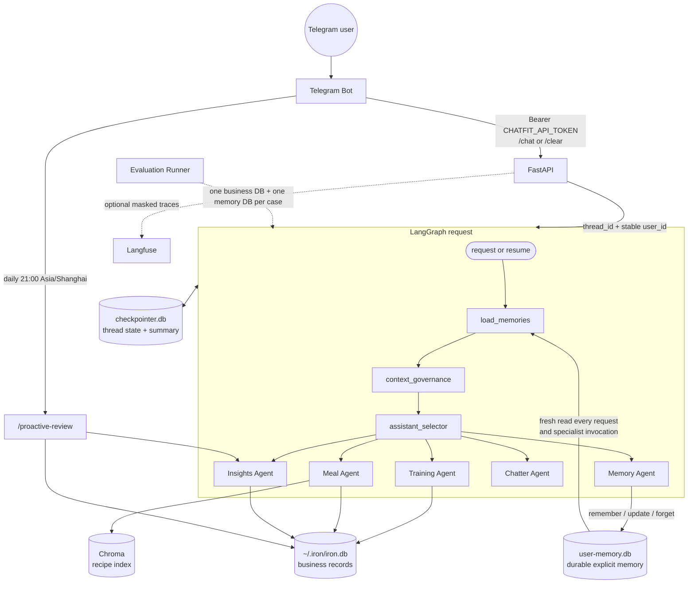

# ChatFit Architecture

ChatFit uses FastAPI and a LangGraph multi-agent graph. Training/meal business
records, conversation checkpoints, and durable user memory have separate
persistence roles and must resolve to distinct SQLite files.



## Request, identity, and authentication

The API requires `CHATFIT_API_TOKEN` at startup. The Bot reads the same value
and sends `Authorization: Bearer <token>` to `/chat` and `/clear`. Missing or
malformed credentials return `401`; a well-formed but incorrect credential
returns `403`. Authentication happens before a caller-supplied `user_id` may
select a thread or durable-memory owner.

The API maps each user to a current random `thread_id` for checkpoint state and
passes the original bounded `user_id` separately to the graph. Durable memory
derives a stable, domain-separated hashed owner key from that user ID. Therefore
rotating a thread with `/clear` does not rotate memory ownership. The local CLI
uses the fixed owner `local-cli`. Evaluation uses `case_id` for both thread and
user identity inside a case, while every case gets its own temporary business
and memory database files.

## Four state layers

| Layer | Stored in | Purpose | Lifetime and clear behavior |
| --- | --- | --- | --- |
| Short-term summary | LangGraph state inside the checkpoint | A compressed, fallible synopsis of older messages in one thread | Replaced as the conversation evolves; a new `/clear` thread does not load the old summary |
| Conversation checkpoint | `CHECKPOINTER_DB_PATH` (`/app/data/checkpointer.db` in Compose) | Messages, pending interrupts, pending memory clarification, and graph execution state | Scoped by `thread_id`; `/clear` starts a new thread without deleting the file |
| Business data | `~/.iron/iron.db` | Training sessions, sets, meals, and facts used by Insights/proactive review | Survives threads, `/clear`, and restarts |
| Durable user memory | `USER_MEMORY_DB_PATH` (`/app/data/user-memory.db` in Compose) | User-authorized preferences, constraints, templates, and profile facts | Freshly loaded on every request; survives new threads, `/clear`, and restarts until explicitly forgotten |

The short-term summary is not a durable-memory writer. `context_governance`
only compresses old messages once a thread grows long. Conversely, the Memory
Agent does not write training or meal records and does not replace checkpoints.

## Durable-memory contract

Only supported explicit command forms authorize a mutation, such as
`记住我乳糖不耐受`, `我不吃香菜，记下来`,
`把 2-1-3 模板更新成……`, and `忘掉乳糖不耐受`. Ordinary chat is not
automatically persisted, and arbitrary natural-language paraphrases are not
promised. Missing content, zero/multiple matches, and ambiguous references lead
to clarification without a database change.

The store preserves the explicit user payload. A row is unique by
`(owner_key, memory_type, canonical_key)`; aliases provide normalized exact
lookup and cannot ambiguously belong to two memories for one owner. An update
keeps the row ID and creation time, replaces content/aliases on that row, and
increments its optimistic-concurrency version. Forget physically deletes the
selected row and cascades its aliases.

## Existing 2-1-3 migration

`scripts/migrate_explicit_memories.py` defaults to dry-run. It opens the source
training database read-only and only approves an explicitly marked, complete
legacy 2-1-3 definition. Other candidates are reported but not imported.

```bash
uv run python scripts/migrate_explicit_memories.py \
  --source-db ~/.iron/iron.db \
  --memory-db runtime-data/user-memory.db \
  --user-id '<telegram-user-id>'

uv run python scripts/migrate_explicit_memories.py \
  --source-db ~/.iron/iron.db \
  --memory-db runtime-data/user-memory.db \
  --user-id '<telegram-user-id>' \
  --apply
```

For apply, the destination's immediate parent directory must already exist.
The source and destination must remain distinct and unchanged during the run.
Repeated application reconciles the same `(owner, training_template, 213)` row
idempotently rather than inserting duplicates.

## Cross-cutting systems

- [Agent Evaluation](evaluation.md) defines datasets, deterministic graders,
  quality metrics, release gates, and the production feedback loop.
- [Agent Observability](observability.md) defines trace identity, span
  hierarchy, instrumentation, metrics, alerts, and privacy controls.
- [Quality and Verification](quality.md) defines static-analysis and test gates.

Evaluation and observability share the same correlation model. A request has
one `trace_id`; related turns share `session_id/thread_id`; evaluation traffic
also carries `run_id` and `case_id`. Observability records execution, while
Evaluation determines whether the behavior was acceptable. DB-state assertions
explicitly select the case's business or durable-memory database.

## Optional proactive review

Proactive Telegram review defaults off. With
`PROACTIVE_REVIEWS_ENABLED=true`, an integer `TELEGRAM_CHAT_ID` selects the one
supported recipient. The Bot JobQueue calls `/proactive-review` at
`21:00 Asia/Shanghai`; missed runs are not replayed. Daily review checks which
of training and meal records are missing. On Saturday, one combined message
contains the Sunday-through-Saturday Insights summary plus any current-day
missing-category reminder.
