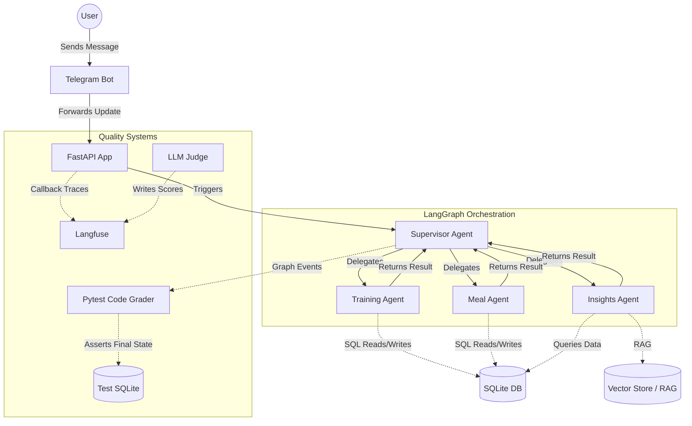

# ChatFit Architecture

The system follows a multi-agent orchestration pattern using LangGraph, persists
business data and conversation checkpoints locally, and optionally exports Agent
trajectories to Langfuse.

## Cross-cutting designs

- [Agent Evaluation](evaluation.md) defines datasets, graders, quality metrics,
  release gates, and the production feedback loop.
- [Agent Observability](observability.md) defines trace identity, span hierarchy,
  execution-path instrumentation, metrics, alerts, and privacy controls.
- [Quality and Verification](quality.md) defines the local static-analysis and
  test gates.

Evaluation and observability share the same correlation model. A test or
production request is represented by one `trace_id`; related turns share a
`session_id/thread_id`; evaluation traffic also carries a `run_id` and
`case_id`. Observability records what happened, while Evaluation decides whether
that behavior was acceptable.
