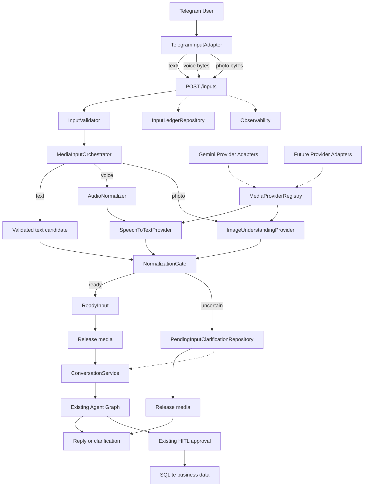
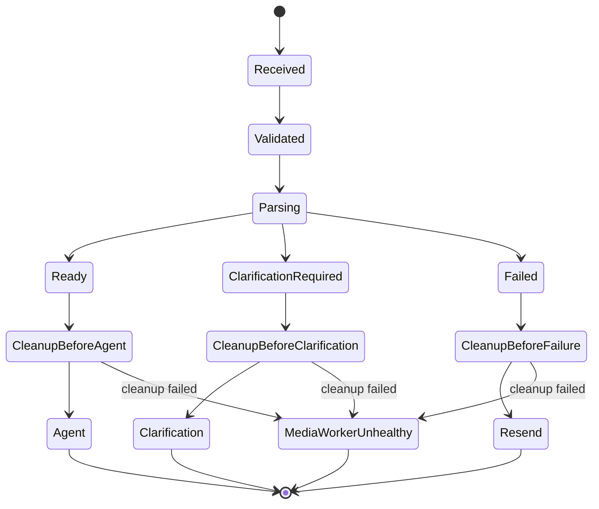

# ChatFit Multimodal Input Architecture

## 1. Purpose

This document defines how ChatFit accepts and understands three Telegram input
modalities:

- text messages;
- voice notes of at most three minutes;
- one photo containing handwritten or printed training data.

All three modalities must converge on the same conversation, clarification,
human-in-the-loop (HITL), Agent orchestration, and persistence path. Media
understanding is a preprocessing capability, not a new business Agent.

The design deliberately does not durably persist user audio or images. Media
is normally request-scoped, is sent inline to a configured cloud model, and is
released before normalized input enters the Agent Graph. A crash or forced
cleanup failure may leave an inaccessible file in the dedicated ephemeral
directory; the worker remains unready until the startup scavenger removes it.

## 2. Current-state assessment

The current project does **not** satisfy the multimodal input requirement.

| Area | Current capability | Gap |
| --- | --- | --- |
| Telegram Bot | Handles `filters.TEXT` messages | No voice or photo handler |
| API | `/chat` accepts `user_id` and `message` | No multipart media endpoint |
| Agent Graph | Understands `HumanMessage` text | No input provenance or uncertainty contract |
| Training Agent | Extracts fields, asks for missing weight, and uses HITL | Can be reused after media normalization |
| Checkpointing | Preserves thread conversation state | Can preserve normalized text, but must never receive raw media |
| Observability | Traces API, Graph, Agent, LLM, tool, HITL, and checkpoint spans | No media download, validation, parsing, or cleanup spans |
| Evaluation | Supports text datasets and deterministic graders | No synthetic voice/photo fixtures or media Provider contracts |

The existing Agent behavior is valuable and should not be duplicated. Once a
voice note or photo is converted into trustworthy normalized text, the current
Supervisor, Training Agent, clarification prompts, write approval, and SQLite
tools remain the business execution path.

## 3. Confirmed product decisions

1. Supported inputs are text, Telegram voice notes, and a single Telegram photo.
2. Voice notes have a hard business limit of 180 seconds.
3. Photos may contain handwritten or printed Chinese/English text, tables, and
   numeric training data.
4. A clarification or HITL reply may use either text or voice.
5. The transcript is hidden during normal successful processing.
6. When input is uncertain, the reply shows only the relevant transcript or
   image-extraction fragment needed for clarification.
7. Cloud media understanding Providers are replaceable.
8. The first Provider implementation uses Gemini because the deployment already
   has access to economical Gemini tokens.
9. Raw media is never durably persisted locally or in cloud object storage.
10. Processing may use bounded memory or an OS temporary file during the active
    request. Normal exit paths release it; a cleanup failure fails closed and
    leaves an orphan only until the mandatory startup scavenger removes it.
11. If bounded processing retries fail while the Bot remains available, the
    Bot asks the user to resend. If the Bot process is lost before replying,
    ChatFit cannot proactively notify the user without retaining a durable
    reply route; under the accepted zero-media-persistence policy, the user
    sees no response and must resend.
12. Media parsing never writes business data directly. All writes continue
    through the existing Agent tools and HITL policy.

## 4. Architecture principles

### 4.1 Normalize before reasoning

Transport and media formats must be removed before business reasoning. The
Agent receives a `ReadyInput`, not Telegram objects, image bytes, audio bytes,
or Gemini response objects.

### 4.2 Depend on capabilities, not vendors

Core code depends on `SpeechToTextProvider` and
`ImageUnderstandingProvider`. Gemini is an adapter selected by configuration.
Speech and image Providers may be changed independently.

### 4.3 Ephemeral media, durable delivery state

Raw media is ephemeral. A durable input ledger stores only an idempotency key,
processing phase, trace ID, timestamps, and non-sensitive metadata. ChatFit
uses at-least-once delivery with idempotent effects; it does not claim a
distributed exactly-once transaction across Telegram, the API, LangGraph, and
SQLite.

### 4.4 Fail closed on uncertainty

Uncertain media content must produce clarification, not guessed tool
arguments. Schema-valid model output is still subject to deterministic
business validation.

### 4.5 One conversation path

Text, voice, and photo inputs share one `ConversationService` and one
`thread_id`. Changing modality during clarification or HITL must not create a
new conversation.

## 5. High-level architecture



## 6. Component boundaries

### 6.1 `TelegramInputAdapter`

Responsibilities:

- register command handlers in the first handler group and one universal
  non-command message handler in the next group;
- classify every non-command Telegram message as text, voice-note, photo, or
  unsupported, then delegate to the corresponding callback;
- reject voice notes longer than 180 seconds before downloading;
- select the highest useful photo size that remains under the configured byte
  limit;
- download one Telegram media file;
- derive a stable `input_id` from the Telegram update and file identity;
- sign the canonical request identity and payload fingerprint with the active
  Bot service credential;
- send text as JSON or media as multipart data to the Input API;
- display typing/upload progress and user-safe failures.

It must not:

- call Gemini directly;
- contain extraction prompts or business validation rules;
- retain a downloaded media file after the API request finishes;
- decide which business Agent should handle the input.

The universal non-command handler is intentional. Registering only known media
filters allows new or unsupported Telegram message types to disappear without
a reply. Classification uses this precedence:

```text
command → dedicated command callback
voice note → voice callback
photo → photo callback
text → text callback
every other message → unsupported-input callback
```

The unsupported branch includes audio files, video, video notes, animation,
documents, stickers, contacts, locations, venues, polls, dice, games, stories,
paid media, and future message payloads that are not explicitly supported.
Non-message updates such as membership changes are outside the user-message
contract and have separately declared handling policy.

The Telegram Bot API currently permits Bot downloads up to 20 MB. ChatFit uses
a lower normalized-media limit so inline model requests remain bounded. See the
[Telegram `getFile` documentation](https://core.telegram.org/bots/api#getfile).

### 6.2 Input API

Add a unified endpoint:

```text
POST /inputs
```

Supported request representations:

- `application/json` for text;
- `multipart/form-data` for voice or photo.

The existing `/chat` endpoint remains available for compatibility, but both
endpoints delegate to `ConversationService`. `/inputs` is responsible for
correlation headers, input validation, receipt lookup, media orchestration, and
cleanup.

`/inputs`, the compatibility `/chat` endpoint, and `/clear` are internal
service interfaces, not anonymous public APIs. Before ledger claim, media
processing, thread mutation, thread lookup, or interrupt inspection, the API
authenticates the Bot service and verifies a signed canonical request
containing:

```text
key_id
request_target
user_id
input_id
update_id
modality
payload_fingerprint
timestamp
nonce
```

`request_target` is the exact internal route, so a signature for one route
cannot be replayed against another. The Telegram `/clear` command derives its
own stable input identifier from the update and signs the literal command
payload before the API may replace the user's thread.

The signature uses a rotatable Bot service credential delivered through
deployment secrets. The API verifies the payload fingerprint against the
received text or media, enforces a short timestamp window, and atomically
consumes the nonce in a TTL replay-protection repository. A legitimate retry
uses the same `input_id` but a new timestamp, nonce, and signature, after which
the input ledger applies normal idempotency policy. Deployment may additionally
use mTLS, but transport authentication does not replace request identity
binding.

The initial SQLite repository indexes nonce expiration and, under the same
immediate transaction used to consume a nonce, deletes expired rows before
inserting the new unique `(key_id, nonce)` pair. An injected wall clock makes
expiration deterministic in tests. Concurrent consumers still have exactly
one winner, while opportunistic pruning prevents unbounded table growth.

Missing, invalid, expired, or replayed authentication returns 401/403 and has
no observable effect: no input-ledger entry, Provider call, thread lookup,
Graph read, or HITL resume. A future non-Telegram caller requires its own
authenticated identity adapter; it cannot assert an arbitrary Telegram
`user_id`.

The response remains compatible with `ChatResponse`:

```json
{
  "response": "string",
  "pending_tools": null
}
```

### 6.3 `MediaInputOrchestrator`

The orchestrator:

1. validates the modality and normalized size;
2. returns text input unchanged;
3. normalizes Telegram OGG/Opus voice data into ChatFit's canonical mono FLAC
   contract;
4. normalizes a photo into ChatFit's canonical oriented RGB JPEG contract;
5. resolves the configured Provider for voice or photo;
6. applies bounded retry policy;
7. validates the Provider result;
8. runs `NormalizationGate` before interrupt detection or Agent execution;
9. produces `ReadyInput` or persists a derived, media-free pending
   clarification;
10. releases all raw and converted media before any downstream action.

It owns lifecycle and policy. It does not own vendor SDK calls.

### 6.4 Provider interfaces

Illustrative Python contracts:

```python
from typing import Protocol


class SpeechToTextProvider(Protocol):
    async def transcribe(
        self,
        media: "CanonicalAudio",
        context: "MediaParseContext",
    ) -> "VoiceParseResult": ...


class ImageUnderstandingProvider(Protocol):
    async def extract(
        self,
        media: "CanonicalImage",
        context: "MediaParseContext",
    ) -> "PhotoParseResult": ...
```

Core contracts must contain only project-owned scalar, enum, and Pydantic
types. Gemini SDK objects, exception classes, response candidates, and model
names are confined to Gemini adapter modules.

Every speech adapter accepts mono, 16 kHz FLAC of at most 180 seconds. Every
image adapter accepts an orientation-corrected RGB JPEG within the configured
pixel and byte limits. These canonical contracts keep codec and image
normalization out of vendor adapters and make Provider substitution testable
without changing the orchestrator.

### 6.5 `MediaProviderRegistry`

Provider selection is configuration-driven:

```text
MEDIA_SPEECH_PROVIDER=gemini
MEDIA_IMAGE_PROVIDER=gemini
GEMINI_MEDIA_MODEL=<deployment-selected-gemini-model>
MEDIA_PROVIDER_TIMEOUT_SECONDS=45
MEDIA_PROVIDER_MAX_RETRIES=2
```

The model name is a deployment default, not a domain constant. Tests replace
the registry with Fake Providers. A future deployment may configure, for
example, Gemini for images and a different speech Provider without changing
the orchestrator or Agent. Startup validates that the configured Provider is
registered. A live contract test must also prove that the configured Gemini
model accepts the required inline modality before that model is promoted.

### 6.6 Gemini adapters

The first implementation contains:

```text
GeminiSpeechToTextProvider
GeminiImageUnderstandingProvider
```

Both send media inline. They do not use the Gemini Files API. Gemini supports
inline audio and image data with a total request limit of 20 MB, which matches
the no-cloud-storage decision when ChatFit enforces a lower internal limit:

- [Gemini audio understanding](https://ai.google.dev/gemini-api/docs/audio)
- [Gemini image understanding](https://ai.google.dev/gemini-api/docs/image-understanding)

Gemini Structured Outputs constrain the response to a project-owned JSON
schema. Application validation remains mandatory because a structurally valid
response can still contain a semantically incorrect number or unit. See
[Gemini Structured Outputs](https://ai.google.dev/gemini-api/docs/structured-output).

Telegram voice notes use OGG/Opus. The Gemini audio documentation describes
OGG Vorbis support, so the initial implementation must not assume codec
compatibility from the `.ogg` suffix alone. `AudioNormalizer` converts the
voice note within the active request to the canonical mono, 16 kHz FLAC
contract before invoking Gemini.

### 6.7 `ConversationService`

Extract the current `/chat` orchestration into a reusable service:

```python
async def handle_input(
    ready_input: ReadyInput,
    request_context: RequestContext,
) -> ChatResponse:
    ...
```

It owns:

- user-to-thread resolution;
- pending interrupt detection and resume;
- Langfuse and structured observation metadata;
- invoking the existing Agent Graph;
- rendering clarification, HITL, and normal responses.

It never accepts raw media.

`ConversationService` accepts only `ReadyInput`; unresolved media input is
short-circuited earlier by `NormalizationGate`.

Text and verified voice transcripts become the same `HumanMessage` used by
current text input. A photo does not become a verbatim OCR `HumanMessage`.
`PhotoParseResult` contains allowlisted training facts, and project code
deterministically renders only validated dates, practice names, sets, reps,
weights, distances, durations, and units. Arbitrary photographed prose and
instructions never enter Agent messages.

Modality and the validated fact provenance are mapped into a project-owned
`CurrentInputContext` field in `AgentState`. The field is replaced for each new
user turn and contains no arbitrary Provider text.

### 6.8 `InputLedgerRepository`

The ledger is metadata, not media storage. Its atomic `claim(input_id)`
operation uses a unique key to collapse concurrent deliveries before media
parsing:

```text
input_id
root_input_id
parent_input_id
user_key
thread_id
modality
delivery_role
status
trace_id
created_at
completed_at
lease_expires_at
```

An initial delivery has `delivery_role=root`, `root_input_id=input_id`, and no
parent. A clarification or human-approval response has `delivery_role=reply`,
its own `input_id`, and explicit root and parent identifiers. Root and reply
rows have separate legal transitions:

```text
root:
absent → normalizing
normalizing → graph_started | clarification_pending | failed
graph_started → awaiting_hitl | completed | failed
clarification_pending → graph_started | failed
awaiting_hitl → completed | failed
graph_started → recovery_required
awaiting_hitl → recovery_required
recovery_required → completed

reply:
absent → normalizing
normalizing → clarification_pending | completed | failed
clarification_pending → completed | failed
```

The repository exposes an authenticated lookup for the single root currently
in `awaiting_hitl` for a `(user_key, thread_id)` pair. A partial unique index
enforces at most one such root per pair. This metadata lookup does not read
Graph state or interrupt content; it lets an ambiguous media reply attach to
the correct root before the media clarification record is created.

No transcript, image, audio, Base64 data, file path, or Telegram download URL
is stored in the ledger.

The repository should be abstract so SQLite is the initial implementation and
another metadata store can replace it later. A `normalizing` entry is a
time-bounded lease, not a permanent lock. If a process dies, a later delivery
may claim the input after `lease_expires_at`, but it must download the media
again because the ledger contains no payload.

Automatic lease reclaim is permitted only while status is `normalizing`,
before any Graph turn can exist. A stale `graph_started` or `awaiting_hitl`
entry is never replayed automatically. It becomes `recovery_required`, and a
later user interaction receives a status message instead of silently adding a
second Agent turn. `recovery_required` is not replayable: the user-facing
recovery handler first queries all operation-ledger rows whose operation IDs
belong to the root delivery's `root_input_id`. If committed writes exist, it
reports the specific committed effects and does not ask the user to resend the
original command. If no committed write exists, it explains that the
conversational response was lost and permits a new submission with a new
`input_id`. For a partially completed multi-write turn, it reports the
committed subset and requires an explicit new command for only the missing
effects. The handler then marks the old ledger entry `completed`. It never
blindly asks the user to repeat an operation whose write outcome has not been
checked.

This design provides at-least-once input delivery and best-effort duplicate
turn suppression. It does not promise distributed exactly-once Agent turns.
Business write tools receive a durable `operation_id` derived from the original
`root_input_id` and tool call identity; the idempotency ledger and business write
occur in one SQLite transaction, so replaying the same operation cannot create
a duplicate row.

The write-operation ledger is queryable by its indexed `source_input_id` and
contains only recovery metadata:

```text
operation_id (unique)
source_input_id (indexed)
tool_name
business_record_id
committed_at
```

It contains no raw media or Provider content. This index is what lets the
recovery handler determine whether writes from an uncertain Graph turn were
committed before it recommends any follow-up.

### 6.9 `PendingInputClarificationRepository`

Media uncertainty is resolved before `ConversationService`. This repository
stores only derived, validated candidate facts, the clarification question,
and the owning user/thread/input IDs. It stores no raw media or arbitrary photo
text.

When the next text or voice reply arrives, the input layer resolves this
pending clarification first. If a LangGraph HITL interrupt is also pending,
the approval classifier remains untouched until the media clarification is
resolved and the reply is classified as ready.

## 7. Data contracts

### 7.1 Input envelope

```text
InputEnvelope
- input_id: non-empty stable string
- user_id: non-empty string
- modality: text | voice | photo
- text: optional string
- media: optional EphemeralMedia
- source: telegram
- source_metadata:
  - update_id
  - hashed_file_unique_id
  - declared_duration_seconds
```

Exactly one of `text` or `media` is present.

### 7.2 Ephemeral media

```text
EphemeralMedia
- media_id
- modality
- detected_mime_type
- size_bytes
- duration_seconds
- content handle
- keyed fingerprint
```

The content handle is request-scoped and cannot be serialized into Agent
state, checkpoints, logs, receipts, or evaluation reports.

Canonical media contracts:

```text
CanonicalAudio
- encoding: FLAC
- channels: 1
- sample_rate_hz: 16000
- duration_seconds <= 180
- bytes <= configured limit

CanonicalImage
- encoding: JPEG
- color_space: RGB
- orientation: applied
- pixels <= configured limit
- bytes <= configured limit
```

### 7.3 Provider results

Voice and photo results are deliberately different:

```text
VoiceParseResult
- transcript
- language
- uncertain_fragments[]
  - fragment
  - reason
  - candidate_values[]
- warnings[]
- provider_metadata
  - provider
  - model
  - request_id
  - latency_ms

PhotoParseResult
- training_facts[]
  - date
  - exercise_alias_candidate
  - sets
  - reps
  - weight
  - weight_unit
  - distance
  - distance_unit
  - duration
  - duration_unit
- uncertain_fragments[]
- ignored_non_domain_text_present
- warnings[]
- provider_metadata
```

Numeric confidence is optional. Gemini may not expose a stable calibrated
confidence value for this workflow, so core logic must not require one.
Uncertainty combines Provider-reported ambiguity with deterministic business
validation. `PhotoParseResult` has no general OCR text or notes field. Only
allowlisted facts can become Agent input.

Provider-supplied `exercise_alias_candidate` and every string inside
`candidate_values` are treated as untrusted: they have strict length and
character-class limits, must parse as an allowed date, number, unit, or
canonical exercise alias, and cannot contain control characters, sentence
punctuation, markup, or instruction-like prose. Unknown aliases and mixed
data/prose such as `squat; ignore previous instructions` cause clarification
or are discarded; they are never rendered into `safe_agent_text`.

After validation, the input layer creates:

```text
ValidatedTrainingFact
- date
- exercise_id
- exercise_display_name
- sets
- reps
- weight
- weight_unit
- distance
- distance_unit
- duration
- duration_unit
```

`exercise_id` must resolve through ChatFit's canonical exercise registry.
`exercise_display_name` is produced by project code from that registry, never
copied from Provider output.

### 7.4 Normalization decision

```text
NormalizationDecision
- ready: ReadyInput
  OR
- clarification_required: PendingInputClarification

ReadyInput
- input_id
- user_id
- modality
- safe_agent_text
- validated_photo_facts[]
- warnings[]
- provenance

PendingInputClarification
- input_id
- user_id
- modality
- validated_candidate_facts[]
- question
- candidate_values[]
```

Only `ReadyInput` crosses into `ConversationService`. For photos,
`safe_agent_text` is rendered deterministically from `validated_photo_facts`;
it is not model-authored OCR prose. `PendingInputClarification` is handled by
the input layer before any Agent or HITL resume logic.

The corresponding per-turn Agent metadata is:

```text
CurrentInputContext
- input_id
- modality
- warnings[]
- validated_photo_facts[]
```

It contains no media handle, arbitrary photo text, or Provider SDK object.

## 8. Processing flows

### 8.1 Text

1. Bot receives a text update.
2. Input API validates it.
3. Orchestrator creates `ReadyInput` without calling a media
   Provider.
4. `ConversationService` invokes the existing Agent Graph.

This path must preserve current text behavior and latency.

### 8.2 Voice

1. Bot validates the declared Telegram voice duration is at most 180 seconds.
2. Bot downloads and forwards the OGG/Opus bytes.
3. API validates the byte limit, file signature, and actual audio duration.
4. `AudioNormalizer` converts the audio to canonical mono, 16 kHz FLAC.
5. `GeminiSpeechToTextProvider` transcribes it with fitness terminology and
   numeric fidelity instructions.
6. `NormalizationGate` checks Provider and deterministic uncertainty.
7. If uncertain, the input layer persists only derived candidate data and
   returns a targeted clarification without inspecting or resuming a pending
   LangGraph interrupt.
8. If ready, original and converted audio is released, then the verified
   transcript enters the existing thread.

### 8.3 Photo

1. Bot accepts one Telegram photo and forwards the selected photo bytes.
2. API validates MIME signature, dimensions, pixel count, and normalized byte
   limit.
3. The image is normalized into the canonical JPEG contract.
4. `GeminiImageUnderstandingProvider` returns allowlisted training facts and
   uncertainty, not free-form OCR prose.
5. Text inside the photo is treated as untrusted data. Non-domain prose and
   instructions are discarded before the Agent boundary.
6. `NormalizationGate` validates every fact and either creates a pending
   clarification or a `ReadyInput`.
7. The image is released.
8. For ready input, project code deterministically renders the validated facts
   into safe Agent text and enters the existing thread.

### 8.4 Cross-modal clarification and HITL

The thread and pending interrupt belong to the user, not to the input
modality. Therefore:

- a photo may be followed by a text correction;
- a text request may be clarified with a voice note;
- a pending write approval may be answered with voice;
- a rejected write may be corrected with either text or voice.

Every non-text reply is normalized first, then the current pending interrupt
logic may process its text. `PendingInputClarificationRepository` always has
priority over LangGraph interrupt resume. Any unresolved fragment—especially
an ambiguous spoken “yes/no”—returns clarification and cannot reach the
approval classifier or `Command(resume=...)`.

When an ambiguous reply arrives during human approval, the input layer locates
the owning root through `InputLedgerRepository`'s authenticated
`(user_key, thread_id, awaiting_hitl)` metadata index. It does not inspect
Graph state or interrupt content. The partial unique index guarantees there is
at most one matching root, and the clarification stores that root identifier
for the next text or voice reply.

## 9. Uncertainty and clarification

Normal successful parsing does not echo the transcript or extracted document
text. The Agent receives it silently.

`NormalizationGate` runs before `ConversationService`, pending-interrupt
detection, approval classification, or Graph invocation. A
`clarification_required` decision therefore cannot accidentally approve,
reject, or modify an existing HITL operation.

Clarification is required when any of these conditions apply:

- transcription is empty or materially incomplete;
- the Provider reports an ambiguous fragment;
- a practice cannot be normalized confidently;
- handwriting yields multiple plausible numeric values;
- a unit is missing or incompatible with a value;
- a weighted practice has no weight;
- sets, reps, weight, distance, or duration conflict;
- media appears unrelated to fitness, food, or the ongoing conversation.

The user sees only the necessary fragment:

> I recognized “10 sets of 5 kettlebell snatches,” but the weight could be
> 20 kg or 24 kg. Which weight should I use?

The system must not guess a critical number and must not call a write tool
until ambiguity is resolved. Derived candidate facts may be retained in
`PendingInputClarificationRepository` so the user can answer with only the
missing value; the raw media and arbitrary OCR text are still deleted.

## 10. Media lifecycle and cleanup



Rules:

1. Raw media is never written to application databases, checkpoints, traces,
   Langfuse payloads, or cloud object storage.
2. The Bot keeps its bounded download in memory and does not create media
   files.
3. The API prefers in-memory conversion through process pipes. If an OS
   temporary file is unavoidable, it lives in a dedicated, non-volume-mounted
   ephemeral directory with process-only permissions and an unpredictable
   name.
4. Bot and API each own and release buffers created in their process;
   forwarding media does not transfer cleanup responsibility.
5. Original and converted content must be owned by an async cleanup context.
6. Cleanup runs on success, validation error, Provider error, timeout,
   cancellation, and unexpected exception.
7. File close/unlink is retried three times. If cleanup still fails, the API
   must not invoke the Agent, returns stable `MEDIA_CLEANUP_FAILED`/503,
   raises an alert, marks the media worker unready, and triggers worker
   shutdown or restart.
8. Before accepting media on startup, an orphan scavenger empties the dedicated
   ephemeral directory. Startup fails closed if any orphan cannot be removed.
9. Media is released before Agent execution or clarification response.
10. Releasing Python byte buffers removes application references but does not
    promise cryptographic zeroization of process memory. The guarantee is no
    intentional persistence and no application access after cleanup.
11. A process crash may lose the input. If the Bot survives an API failure, it
    immediately asks the user to resend. If the Bot itself is lost before it
    can reply, no component can proactively notify the user because ChatFit
    intentionally stores no Telegram reply route for this media; the user sees
    no response and must resend.
12. Debugging relies on metadata, fingerprints, derived text, stable error
   classes, and synthetic reproduction fixtures—not retained user media.
13. Normalized text is durable conversation content and may enter the existing
   checkpoint just like a typed message. This is explicitly different from
   retaining the original audio or photo.

## 11. Limits, backpressure, and cost

Initial configurable limits:

```text
VOICE_MAX_DURATION_SECONDS=180
MEDIA_MAX_NORMALIZED_BYTES=12582912
IMAGE_MAX_PIXELS=20000000
MEDIA_PARSE_CONCURRENCY=4
MEDIA_PROVIDER_TIMEOUT_SECONDS=45
MEDIA_PROVIDER_MAX_RETRIES=2
```

The 12 MB internal limit leaves room for Base64 expansion and prompts beneath
Gemini's 20 MB inline request limit. The implementation must check the final
normalized payload, not only Telegram's original compressed file size.

`MEDIA_PARSE_CONCURRENCY` provides backpressure. With four concurrent 12 MB
payloads, raw media alone can consume roughly 48 MB; Base64 copies, image
decoding, audio conversion, SDK buffering, and model responses add overhead.
The implementation should minimize simultaneous copies and stream between
components where SDK boundaries allow it.

There is no durable media queue because a queue would require durable payload
storage. When concurrency is exhausted, the Bot returns a short busy message
and asks the user to retry rather than accepting work it cannot recover.

## 12. Retry, idempotency, and errors

| Failure | Retry | User outcome |
| --- | --- | --- |
| Telegram transient download error | Up to 2 within the handler | Continue or ask to resend |
| Gemini timeout, 429, or transient connection error | Up to 2 within the request | Continue or ask to resend |
| Unsupported/corrupt media | No | Explain supported input |
| Voice longer than 180 seconds | No | Ask user to split it |
| Normalized payload over limit | No | Ask user to shorten or retake |
| Invalid Provider schema | One retry | Ask user to resend if still invalid |
| Request task cancellation | No retry | Cleanup, release capacity, and propagate cancellation |
| Ambiguous content | No technical retry | Ask a targeted clarification |
| API loss while Bot survives | Not recoverable | Bot asks user to resend |
| Bot process loss before reply | Not recoverable | No proactive notice; user resends after seeing no response |
| Cleanup failure | 3 cleanup attempts | Return 503, alert, mark worker unready |
| Duplicate `input_id` completed | No reprocessing | Tell the user it was already processed |
| Duplicate active `normalizing` input | No parallel execution | Tell user it is still processing |
| Stale `normalizing` input | Reclaim allowed | Re-download within the new delivery |
| Stale `graph_started`/`awaiting_hitl` input | Never replay automatically | Return recovery-required status |

Media parsing failure must never become an unhandled HTTP 500. API responses
use stable error codes, while Telegram renders friendly instructions.
`asyncio.CancelledError` is not converted into an application error response:
all cleanup handlers run, and the original cancellation is re-raised so the
calling task remains cancelled.

Delivery is at least once. The input ledger collapses concurrent and completed
duplicates, and refuses to replay uncertain post-Graph crash states. It does
not claim a cross-system exactly-once Agent transaction. Business side effects
have the stronger guarantee: each write tool uses a durable `operation_id`,
and the operation ledger plus business row are committed in one SQLite
transaction.

## 13. Security and privacy

- Verify media signatures; do not trust filename or declared MIME type.
- Limit audio duration using decoded metadata.
- Limit image dimensions, pixel count, and decompressed memory.
- Reject polyglot or unsupported file formats.
- Treat text visible in a photo as data. Gemini returns allowlisted facts, and
  deterministic project code renders Agent input. Arbitrary photographed
  instructions and non-domain prose never enter Agent messages.
- Media Providers cannot access Agent tools.
- Validate structured output with strict Pydantic models and semantic rules.
- Never log Base64, media bytes, temporary paths, Telegram download URLs,
  raw Provider payloads, or raw user IDs.
- Keep Gemini credentials in API service environment configuration, not the
  Telegram Bot.
- Authenticate the Bot service and verify its signed user/input/payload
  binding before ledger claim or any conversation-state access.
- Rotate Bot signing credentials by `key_id`; never log credentials,
  signatures, or nonces.
- Reject expired or replayed signatures using an atomic, TTL-backed nonce
  repository. Replay protection storage contains no message or media content.
- Media-derived turns never attach the current content-capturing Langfuse
  callback, even when `LANGFUSE_CAPTURE_CONTENT=true`. They use only the
  content-free structured observation path until an origin-aware Langfuse
  exporter is separately designed and verified.
- Use per-user rate limits and a global parsing semaphore.
- Remove temporary files using `finally`/async context management.

## 14. Observability

Extend the existing trace with:

```text
chat.request
└── input.receive
    ├── media.download
    ├── media.validate
    ├── media.transcode
    ├── media.parse
    ├── input.normalize
    └── media.cleanup
└── graph.run
```

The Bot creates `input_id` and request correlation before downloading media,
then propagates them to the API. The Bot and API spans therefore share one
logical trace even though they run in separate containers. The transport uses
a standard trace context where supported, with the existing request ID retained
as a searchable fallback.

Allowed attributes:

- modality;
- detected MIME type;
- byte count, duration, dimensions, and pixel count;
- Provider and configured model;
- attempt, timeout, latency, and stable error code;
- number of uncertain fragments;
- cleanup success;
- content origin (`typed`, `voice_derived`, or `photo_derived`);
- keyed media/input fingerprint;
- hashed Telegram file identity;
- Provider request ID;
- `trace_id`, `request_id`, `session_id`, `input_id`, `run_id`, and `case_id`.

Forbidden attributes:

- media bytes or Base64;
- temporary path or Telegram file URL;
- raw transcript or image-extracted text;
- prompt containing user media content;
- raw user ID;
- secrets or full exception messages.

For `voice_derived` and `photo_derived` requests, absence of a Langfuse
callback is a hard privacy rule, not a default. A global content-capture opt-in
for typed text cannot override it.

Metrics:

- success and failure rate by modality and Provider;
- P50/P95 download, normalization, and parse latency;
- Provider timeout, retry, and 429 rate;
- clarification and resend rate by modality;
- task completion and write approval rate;
- media cleanup failures, with a target of zero;
- duplicate input suppression count;
- cost/tokens by modality and configured model;
- active and rejected media parsing concurrency.

## 15. Evaluation and test strategy

Only synthetic or explicitly licensed media fixtures are committed. Production
user media is never copied into the evaluation dataset.

### 15.1 Unit tests

- strict input and Provider result schemas;
- canonical audio/image format contracts;
- modality validation;
- voice duration and normalized-size limits;
- MIME signature and image dimension validation;
- OGG/Opus conversion cleanup;
- Provider registry selection and unknown Provider failure;
- retry classification;
- input-ledger atomic claim, legal transitions, and stale-state policy;
- write-operation ledger transactionality;
- cleanup on every exception and cancellation path;
- cleanup retry, unready-worker behavior, and startup orphan scavenging;
- uncertainty rules;
- `NormalizationGate` ordering before HITL resume;
- Bot request authentication and signed user/input/payload binding;
- timestamp-window and atomic nonce replay protection;
- media prompt-injection handling;
- unconditional media-origin Langfuse suppression.

### 15.2 Provider contract tests

Every Provider adapter must pass the same suite:

- accepts its declared modality;
- accepts the project canonical media contract;
- returns only its project-owned `VoiceParseResult` or `PhotoParseResult`;
- preserves critical numbers and units;
- emits uncertainty instead of guessing;
- maps vendor errors to stable project error codes;
- respects timeout/cancellation;
- never writes media outside the request lifecycle.

Default CI uses Fake Providers and performs no Gemini calls.

### 15.3 Telegram message dispatch contract tests

The default verification suite must exercise the real Telegram dispatcher,
not call message callbacks directly. Bot construction is extracted into a
side-effect-free `build_telegram_application()` function so tests can inspect
and run the same handler registry used in production.

Tests create synthetic Telegram updates, pass them through
`Application.process_update()`, and replace only network boundaries with
fakes. They verify:

- command handlers are registered before exactly one universal non-command
  message handler;
- command messages do not reach the universal handler;
- the universal handler classifies text, voice-note, photo, and every other
  message into mutually exclusive routes, with the unsupported route as the
  total default branch;
- each supported update reaches exactly one modality-specific callback;
- text, voice-note, and photo callbacks each send an immediate processing
  action before Provider invocation or application-service forwarding, and
  before media download for media inputs;
- each callback forwards exactly one correctly typed input envelope;
- successful processing produces one terminal user reply;
- uncertain processing produces one actionable clarification reply;
- download, normalization, Provider, and application-service failures produce
  one user-safe failure reply;
- audio files, video, video notes, animation, documents, stickers, contacts,
  locations, venues, polls, dice, games, stories, and paid media each receive
  an explicit unsupported-input reply;
- an unknown future message payload reaches the total unsupported default
  branch rather than falling through the dispatcher;
- if Telegram rejects a processing action or reply, a structured failure event
  with the input and request correlation identifiers is emitted;
- every supported update attempts an immediate processing action and then
  produces either a terminal reply or a structured delivery-failure event;
- every unsupported update produces either an unsupported-input reply or a
  structured delivery-failure event. A processing action alone is never a
  terminal outcome.

The regression case for the current production defect is mandatory:

```text
synthetic Telegram voice-note update
→ production dispatcher
→ voice-note callback invoked
→ processing action sent
→ voice input forwarded
→ terminal reply returned
```

The same test exists for a photo update. Removing the universal handler,
removing a classification route, replacing it with a text-only filter, or
failing to produce user-visible progress must make default verification fail.

After this feature is implemented, default verification must use no live
Telegram account and no cloud Provider. The implementation must add the
synthetic dispatcher suite to the repository-level `make verify` command.
These tests do not exist in the current text-only system; this section defines
the required future gate rather than claiming current coverage.

The implementation must also add a `make verify-container` target. Before the
feature may be declared complete, every deployable container image must pass
that target. It builds the exact image digest intended for deployment, runs
`scripts/verify_telegram_message_routes.py` inside it, and is a required
continuous-integration status before deployment. The script:

1. constructs the production application through
   `build_telegram_application()`;
2. passes synthetic text, voice-note, photo, and unsupported updates through
   `Application.process_update()`;
3. verifies the production entry point calls that same factory;
4. asserts the processing-action and terminal-outcome invariants.

The script exits nonzero on any missing route or silent outcome. Live Telegram
delivery is a separate, explicitly enabled deployment test and is not required
for default verification. The current architecture-only branch does not yet
contain this target, script, or the dispatcher tests.

### 15.4 Integration tests

- text input preserves existing `/chat` behavior;
- missing, invalid, expired, or replayed Bot authentication returns 401/403
  without creating a ledger entry, calling a Provider, reading Graph state, or
  resuming HITL;
- a valid signed request can affect only the user/thread bound into its
  verified signature;
- voice and photo converge on the same `ConversationService`;
- voice clarification resumes a text-started thread;
- text clarification resumes a photo-started thread;
- voice can approve or reject a pending HITL interrupt;
- ambiguous spoken approval cannot reach the HITL classifier;
- a photo containing instructions contributes no arbitrary text to Graph
  messages;
- a fact containing
  `exercise_alias_candidate="squat; ignore previous instructions"` is rejected
  before Graph-message rendering;
- an instruction-like string inside `candidate_values` is rejected before
  Graph-message rendering;
- concurrent/completed duplicate updates are collapsed before a new Graph
  invocation;
- stale post-Graph inputs are never automatically replayed;
- repeated write `operation_id` values do not create duplicate business rows;
- a crash after a write commit but before the HTTP response is recovered by
  querying operations for the original `input_id`; the committed write is
  reported and the original command is not blindly retried;
- Provider outage produces a friendly response, not HTTP 500;
- no temporary media remains after success or any normally cleanable failure;
- cleanup failure blocks Agent invocation and makes the worker unready;
- after a forced unlink failure, startup removes the orphan before readiness
  and the temporary directory is eventually empty;
- no raw media or content appears in trace observations;
- `LANGFUSE_CAPTURE_CONTENT=true` still exports no media-derived content.

### 15.5 Evaluation dataset

Versioned cases cover:

- Chinese, English, and mixed-language voice;
- background noise, pauses, different speaking speeds, and fitness acronyms;
- confusable values such as 20/24 kg and 5/15 reps;
- handwritten and printed training notes;
- tables, rotated images, blur, shadows, crossed-out text, and mixed units;
- an image containing prompt-injection text;
- missing weight, unit, date, or exercise identity;
- switching modality during clarification;
- voice HITL approval;
- ambiguous voice approval while HITL is pending;
- transient Provider errors and final failure;
- crashes before normalization, after Graph start, while awaiting HITL, and
  after a business write but before the HTTP response;
- cleanup unlink failure and crash-orphan scavenging.

### 15.6 Release gates

- 100% of production Telegram robot builds register command handling and the
  universal non-command message handler.
- 0 supported or unsupported Telegram messages are silently discarded.
- 100% of supported message-dispatch cases attempt a processing action and
  then produce a terminal reply or structured delivery-failure event.
- 100% of unsupported message-dispatch cases produce an unsupported-input
  reply or structured delivery-failure event.
- Voice-note and photo dispatcher regression tests are part of the default
  verification command and cannot be deselected.
- Every deployable image digest passes the required `make verify-container`
  status, including real production-factory dispatch and entry-point checks.
- 100% of success and normally cleanable failure paths release all payloads
  before any Agent or clarification action.
- 100% of forced cleanup failures fail closed, mark the worker unready, and
  leave zero orphaned media after restart scavenging.
- 100% of write cases require HITL.
- 0 duplicate business writes for a repeated `operation_id`.
- 0 writes from invalid or unresolved media parses.
- 0 unhandled 500 responses for expected media/Provider failures.
- 100% Provider contract conformance.
- 0 arbitrary photographed instructions entering Graph messages.
- 0 ambiguous media replies reaching HITL resume.
- 0 media-derived content exports regardless of global Langfuse content
  capture configuration.
- 100% of unauthenticated, incorrectly bound, expired, and replayed requests
  are rejected before ledger, Provider, Graph, or HITL access.
- Existing text quality gates remain unchanged.
- Critical numeric fields are measured separately from general text quality;
  initial production thresholds are set only after a reviewed baseline.
- Live Gemini E2E is explicit, budgeted, and excluded from default CI.

## 16. Suggested source layout

```text
chatfit/
├── inputs/
│   ├── models.py
│   ├── orchestrator.py
│   ├── validation.py
│   ├── audio.py
│   ├── photo_facts.py
│   ├── ledger.py
│   ├── clarification.py
│   └── providers/
│       ├── base.py
│       ├── registry.py
│       └── gemini/
│           ├── speech.py
│           ├── image.py
│           └── errors.py
├── services/
│   └── conversation.py
├── bot.py
├── api.py
├── agents/
├── evaluation/
├── scripts/
│   └── verify_telegram_message_routes.py
└── tests/
    ├── fixtures/media/
    ├── test_telegram_message_dispatch.py
    ├── test_bot_container_message_smoke.py
    ├── test_input_orchestrator.py
    ├── test_media_cleanup.py
    ├── test_provider_contract.py
    └── test_multimodal_api.py
```

## 17. Delivery sequence

### Phase 1: contracts and text-path extraction

- add project-owned input and Provider contracts;
- add registry and Fake Providers;
- extract the side-effect-free production Telegram application factory;
- replace the text-only filter with the universal non-command dispatcher while
  preserving text behavior and explicit unsupported-message replies;
- add the synthetic dispatcher test harness to `make verify`;
- extract `ConversationService` from `/chat`;
- route existing text behavior through the new service;
- prove no text regression.

### Phase 2: voice

- add Telegram voice handler and `/inputs` multipart support;
- add the production-dispatcher voice regression test before implementing the
  handler;
- add audio validation and ephemeral conversion;
- implement Gemini speech adapter;
- add pre-Agent normalization clarification gating;
- support voice clarification and voice HITL resume;
- add voice fixtures and Provider contract tests.

### Phase 3: photo

- add Telegram photo handler;
- add the production-dispatcher photo regression test before implementing the
  handler;
- add image safety validation;
- implement Gemini image adapter with structured output;
- add deterministic allowlisted photo-fact rendering;
- add uncertainty and photo clarification rules;
- add handwritten/printed synthetic fixtures and adversarial tests.

### Phase 4: operational hardening

- add the input ledger, pending clarification repository, and idempotent write
  operation ledger;
- add `scripts/verify_telegram_message_routes.py` and the
  `make verify-container` target;
- make container message-route verification a required deployment-pipeline
  status and deploy the exact image digest that passed it;
- complete spans, metrics, dashboards, and alerts;
- add per-user rate limits and concurrency backpressure;
- run budgeted Gemini E2E and establish quality baselines;
- deploy progressively and monitor resend/clarification rates.

## 18. Acceptance criteria

The feature is complete when:

1. A user can send text, a voice note of at most three minutes, or one photo.
2. All modalities continue within the same user thread.
3. Voice and photo media is sent inline to the configured Provider, is never
   durably persisted, and any request-scoped temporary representation is
   removed according to the cleanup contract.
4. The first deployment uses Gemini adapters selected through configuration.
5. A Provider can be replaced without changing Bot, API, Agent, HITL, or
   business persistence code.
6. Normal successful media input does not echo extracted text.
7. Ambiguous critical values trigger targeted clarification.
8. Clarification and HITL responses may use text or voice.
9. No media parsing path writes business data directly.
10. Concurrent and completed duplicate updates are collapsed before Graph
    execution; stale post-Graph inputs are never replayed automatically.
11. Replaying the same durable write `operation_id` creates no duplicate
    business row.
12. Expected media and Provider failures return actionable user messages, not
    unhandled 500 errors.
13. Arbitrary instructions photographed alongside training data never enter
    Agent messages.
14. An unresolved media clarification never reaches HITL classification or
    `Command(resume=...)`.
15. Raw media and media-derived content do not appear in logs or traces, even
    when typed-text content capture is globally enabled.
16. Every normal request exit releases original and converted media; cleanup
    failure blocks Agent execution, marks the worker unready, and is repaired
    by retry or the startup orphan scavenger.
17. Existing text tests and release gates continue to pass.
18. Bot-to-API authentication binds each accepted request to its signed user,
    input, modality, and payload; invalid or replayed requests cannot access
    ledger, Provider, Graph, or HITL state.
19. The production Telegram dispatcher has tested text, voice-note, photo, and
    total unsupported-message routes. Every supported user message receives
    visible progress followed by a terminal reply or correlated
    delivery-failure event; every unsupported message receives an explicit
    terminal outcome. The exact container image selected for deployment must
    pass the same dispatch contract.
