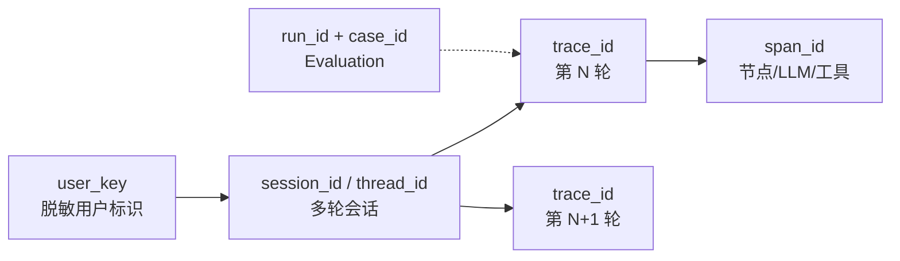
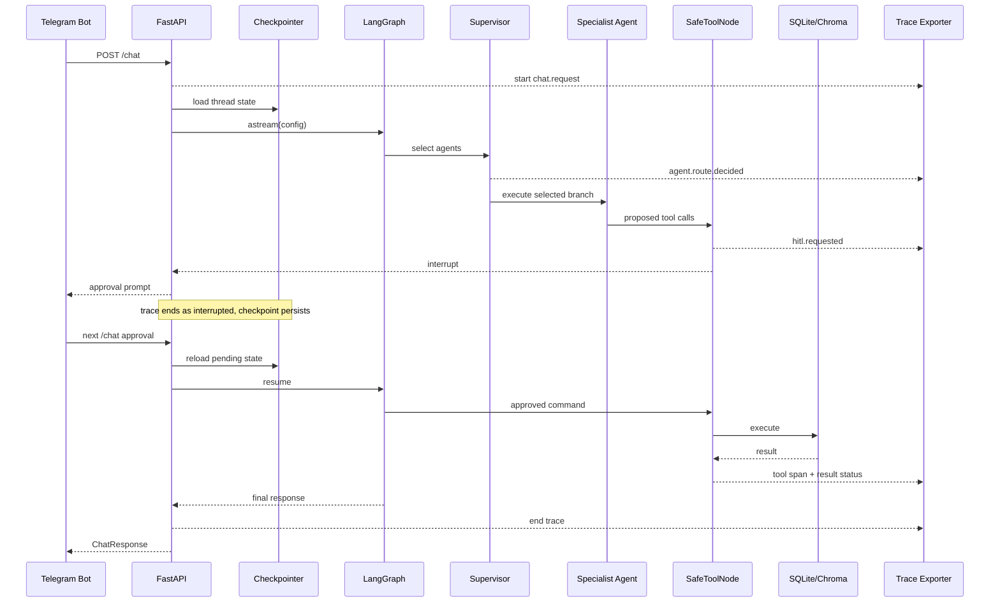

# Agent Observability 设计

本文定义 ChatFit 如何跟踪一次请求在多 Agent Graph 中的完整执行路径，并将日志、
trace、指标和 Evaluation 结果关联起来。目标是在不读取用户完整对话的情况下，也能回答：

- 请求经过了哪些节点，为什么被路由到这些 Agent？
- 调用了哪些 LLM 和工具，各自耗时、重试和结果如何？
- 是否进入 Human-in-the-loop，最终批准、拒绝还是放弃？
- 上下文何时被压缩，checkpoint 是否成功？
- 失败发生在哪一层，是否影响用户请求或数据一致性？

## 1. 设计原则

1. **业务可用性优先**：Observability 是旁路能力，初始化、上报或后端故障不能让
   `/chat` 失败。
2. **一条路径，一个根 Trace**：每次 `/chat` 请求创建一个 trace，所有 Graph node、
   LLM、工具、数据库和 HITL 事件都是它的子 span/event。
3. **跨轮关联但不混淆**：`trace_id` 标识一次请求，`session_id/thread_id` 关联多轮，
   `user_id` 只使用脱敏标识。
4. **结构化优先**：节点、工具、状态和错误使用稳定字段，不依赖解析自由文本日志。
5. **默认最小采集**：优先采集元数据、哈希、大小和状态；原始 prompt、工具参数和
   健康数据默认不进入外部观测后端。
6. **可评估**：Evaluation case、线上反馈和 trace 使用同一关联模型。

## 2. 信号模型

| 信号 | 用途 | 示例 |
| --- | --- | --- |
| Trace | 表示一次端到端 `/chat` 请求 | 用户输入到最终响应 |
| Span | 表示有开始、结束和耗时的操作 | Graph node、LLM、工具、DB |
| Event | 表示 span 内的瞬时状态变化 | 路由决定、interrupt、重试 |
| Metric | 聚合运行健康和业务质量 | P95 latency、tool error rate |
| Log | 记录离散诊断信息 | tracing 降级、checkpoint 打开失败 |
| Evaluation score | 表示某条 trace 的质量 | task completion、tone、groundedness |

Langfuse 是当前 LLM/Agent trace 后端，但应用层字段应保持后端无关。未来可以通过适配器
同时输出到 OpenTelemetry、日志平台或自托管存储，而无需改变 Agent 业务代码。

## 3. 标识与关联



| 字段 | 生命周期 | 规则 |
| --- | --- | --- |
| `trace_id` | 单次 API 请求 | 服务端生成，全局唯一 |
| `span_id` | 单次操作 | trace 内唯一，保留 parent-child 关系 |
| `session_id` | 多轮对话 | 与 LangGraph `thread_id` 一致 |
| `user_key` | 用户 | 对 `user_id` 做 keyed hash，不上传原值 |
| `request_id` | HTTP 请求 | 进入 API 时生成或接收可信网关值 |
| `run_id` | 一次 Evaluation/实验 | 关联 commit、模型、Prompt、数据集 |
| `case_id` | 一个 Evaluation case | 只在评估流量中出现 |

当前 `api.py` 已为每次请求生成 `trace_id/request_id`，将 `session_id` 和 keyed
`user_key` 放入 callback metadata，并通过响应头返回 trace/request ID。原始
`user_id` 不再进入观测 metadata。Langfuse prompt/output 默认由 mask 替换为
`[REDACTED]`；只有部署方显式设置 `LANGFUSE_CAPTURE_CONTENT=true` 才会上报正文。

## 4. Trace 层级

建议的标准路径：

```text
chat.request
├── checkpoint.load
├── graph.run
│   ├── context_governance
│   │   └── llm.context_summary       # 只有触发摘要时
│   ├── assistant_selector
│   │   └── llm.route
│   ├── agent.training|meal|insights|chatter
│   │   ├── llm.generate
│   │   ├── hitl.approval             # 写操作才出现
│   │   ├── tool.<tool_name>
│   │   │   └── db|rag.operation
│   │   └── llm.finalize
│   └── checkpoint.save
└── chat.response
```

并行路由时，多个 Agent span 共享 `graph.run` 父节点，但各自保持独立的开始、结束、
状态和子工具路径。不能只记录一条拼接后的平面日志，否则无法判断并行分支和关键路径。

## 5. Span 与 Event Schema

所有 span 使用统一公共字段：

```json
{
  "name": "tool.log_training_session",
  "trace_id": "01...",
  "span_id": "01...",
  "parent_span_id": "01...",
  "session_id": "thread-...",
  "request_id": "request-...",
  "service": "chatfit-api",
  "environment": "production",
  "version": "git-sha",
  "start_time": "RFC3339",
  "duration_ms": 42,
  "status": "ok",
  "attributes": {
    "agent.name": "training",
    "tool.name": "log_training_session",
    "tool.attempt": 1,
    "tool.write": true
  }
}
```

### 状态

`status` 只允许：

- `ok`：操作完成
- `error`：永久失败
- `timeout`：超过预算
- `cancelled`：请求取消
- `interrupted`：等待用户确认
- `degraded`：旁路能力失败但主流程继续

错误字段应包含 `error.type`、稳定的 `error.code`、是否可重试和经过清洗的短消息。
不得上传包含密钥、完整 SQL 参数、用户完整对话或堆栈中的环境变量。

### 路由 Event

`agent.route.decided`：

- `candidate_agents`
- `selected_agents`
- `message_count`
- `summary_present`
- `decision_latency_ms`
- `fallback_used`

不要记录 LLM 的隐藏推理。需要诊断路由时记录输入类别、可审计的路由结果和明确配置，
而不是要求或存储 chain-of-thought。

### LLM Span

- provider、model、temperature、max tokens
- input/output token 数和估算成本
- 首 token 与总耗时
- attempt、timeout、rate-limit、finish reason
- prompt template/version
- tool schema names
- 输入输出大小、哈希和采样状态

原始 prompt/output 仅在用户允许、受控环境和短期留存策略下采样。

### Tool Span

- tool name、Agent、read/write 类型
- 参数 schema 版本、参数大小和脱敏摘要
- attempt、重试原因、执行耗时
- output status、output size、是否截断
- 幂等键或副作用 ID

对于 SQLite，只记录操作名、表类别、影响行数和耗时；不记录拼接 SQL、完整健康数据
或数据库文件内容。对于 RAG，记录 query hash、top-k、命中文档数量、分数分布和
source ID hash。

### HITL Event

一次确认流程至少产生：

1. `hitl.requested`：待确认工具数量和类别
2. `hitl.resumed`：`approved/rejected/expired`，不记录用户完整回复
3. `hitl.executed` 或 `hitl.cancelled`

关键指标包括等待时间、批准率、拒绝后副作用数和重复执行数。拒绝后副作用数必须为 0。

### Context Event

`context.governance` 记录：

- 压缩前后消息数量
- 压缩前后估算 token
- 是否存在历史 summary
- 删除的消息数量
- 是否跨越 tool-call 边界
- summary 版本、大小和哈希

只记录摘要正文的哈希与大小，默认不上传摘要内容。

## 6. 执行路径采集点

| 位置 | 当前信号 | 目标补充 |
| --- | --- | --- |
| FastAPI `/chat` | callback metadata | 根 trace、request ID、HTTP status、总耗时 |
| LangGraph stream | node update | node span、父子关系、并行分支 |
| `assistant_selector` | `assistant_names` | route event、fallback、latency |
| Context governance | summary state | message/token delta、summary hash |
| LLM factory/safe execution | callback、错误文本 | model span、attempt、timeout、token |
| `SafeToolNode` | ToolMessage、interrupt | tool span、retry、truncate、HITL event |
| SQLite handler | 返回值 | 操作名、耗时、影响行数、事务结果 |
| RAG | Document metadata | top-k、命中数、source hash、retrieval latency |
| Checkpointer | SQLite saver | load/save latency、错误、DB availability |
| Telegram Bot | HTTP error text | request correlation、backend status 分类 |

优先在共享边界采集：API middleware、LLM factory、SafeToolNode、repository 和 RAG
adapter。不要在每个 Agent Prompt 内手工拼装日志。

## 7. 一次请求的路径



HITL 会跨两个 HTTP 请求。两个请求拥有不同 `trace_id`，通过同一 `session_id` 和
`interrupt_id` 关联，避免创建持续数小时的开放 span。

## 8. 指标、SLI 与建议 SLO

先建立基线，再正式承诺 SLO。建议初始观测项：

| SLI | 建议目标 | 切片 |
| --- | --- | --- |
| `/chat` availability | ≥ 99.5% | environment、API version |
| 非 HITL 请求 P95 latency | ≤ 30s | Agent、model、route |
| LLM permanent error rate | < 1% | provider、model、error code |
| Tool permanent error rate | < 0.5% | tool name、attempt |
| Tracing-induced request failure | 0 | exporter/version |
| HITL 拒绝后副作用 | 0 | tool name |
| Checkpoint load/save failure | < 0.1% | DB path/environment |
| Empty successful response | < 0.1% | Agent、finish reason |

Dashboard 至少包含：

- 请求量、成功率、P50/P95/P99 延迟
- 按 Agent 展开的路由量、错误率和耗时
- LLM token、成本、timeout、429 和重试
- 工具成功率、重试、截断和数据库副作用
- HITL 请求/批准/拒绝/超时
- checkpoint 与 RAG 健康度
- Evaluation score 与版本趋势

## 9. 告警与排障

建议告警：

- 5 分钟 `/chat` 5xx 比例超过 2%
- tracing/exporter 异常突然增加，但单独作为降级告警
- 某工具永久错误率连续 10 分钟超过 5%
- checkpoint load/save 出现任何持续性错误
- HITL 拒绝后出现写副作用
- P95 latency 或 token/cost 相比基线增长超过 20%

排障顺序：

1. 使用 `request_id` 或 `trace_id` 找到根 trace。
2. 确认失败在 API、checkpoint、router、Agent、LLM、tool 还是 exporter。
3. 查看最深的非 `ok` span 及其稳定错误码。
4. 检查重试是否成功、是否触发降级、是否产生副作用。
5. 通过 `session_id` 查看前后轮，但只授予最小必要的数据访问权限。
6. 将确认的缺陷转换为脱敏 Regression case。

## 10. 可靠性与降级

- Callback/exporter 初始化失败：记录 `observability.init_failed`，使用 no-op tracer。
- 发送失败：异步缓冲并限长；缓冲满时丢弃低优先级 span，不阻塞聊天。
- 后端超时：短超时、熔断和指数退避，禁止无限重试。
- 采样：错误和 Evaluation trace 100%，普通成功 trace 按比例采样。
- 进程退出：在有限时间内 flush；超时后允许退出。
- 所有观测代码必须有故障注入测试，验证不会改变 Agent 返回值或数据库副作用。

当前 `create_langfuse_callback()` 已实现初始化失败降级。后续的 exporter、显式 span
和指标采集必须保持同样的 fail-open 约束。

## 11. 隐私、安全与保留

ChatFit 数据可能包含健康、饮食和行为信息，应按敏感数据处理：

- 默认不上报原始 `user_id`、消息、summary、工具参数和数据库结果
- 使用 keyed hash 生成 `user_key`，密钥定期轮换
- 对密钥、token、Authorization header、路径用户名做统一 redaction
- 生产 trace 访问使用最小权限并保留审计日志
- 明确开发、测试和生产数据隔离
- 错误 trace 短期保留，聚合指标可长期保留
- 删除用户数据时，观测后端中的可关联数据也必须进入删除流程

建议保留策略：

| 数据 | 默认保留 |
| --- | --- |
| 原始内容采样 | 关闭；经批准时不超过 7 天 |
| 脱敏 trace | 30 天 |
| 错误 trace | 60 天 |
| 聚合指标 | 13 个月 |
| Evaluation 结果 | 随对应 release 长期保留 |

具体期限应根据部署地区和组织政策调整。

## 12. 当前状态与实施阶段

| 阶段 | 内容 | 状态 |
| --- | --- | --- |
| Phase 0 | Langfuse callback、session/user metadata、失败降级 | 已完成 |
| Phase 1 | 根 trace、request/trace ID、结构化日志、user hash | 已完成 |
| Phase 2 | Graph node、LLM、tool、HITL、checkpoint 显式 span | 基本完成；DB/RAG 专用 span 待补 |
| Phase 3 | 指标、dashboard、告警、采样与保留策略 | 待实现 |
| Phase 4 | Evaluation score、生产反馈与 Regression 闭环 | Scorecard 已实现；线上闭环待补 |

Phase 1–2 的验收标准：

- 任意 `/chat` 请求都可重建有序或并行的 Agent 执行路径
- HITL 跨请求可通过 `session_id + interrupt_id` 关联
- 工具失败可定位到工具、attempt 和稳定错误码
- tracing 后端完全不可用时，API 回归测试仍返回正常业务响应
- trace 中不存在原始用户标识、密钥和未经许可的健康数据

## 13. 相关文档

- [系统架构](architecture.md)
- [Agent Evaluation 设计](evaluation.md)
- [质量与验证](quality.md)
