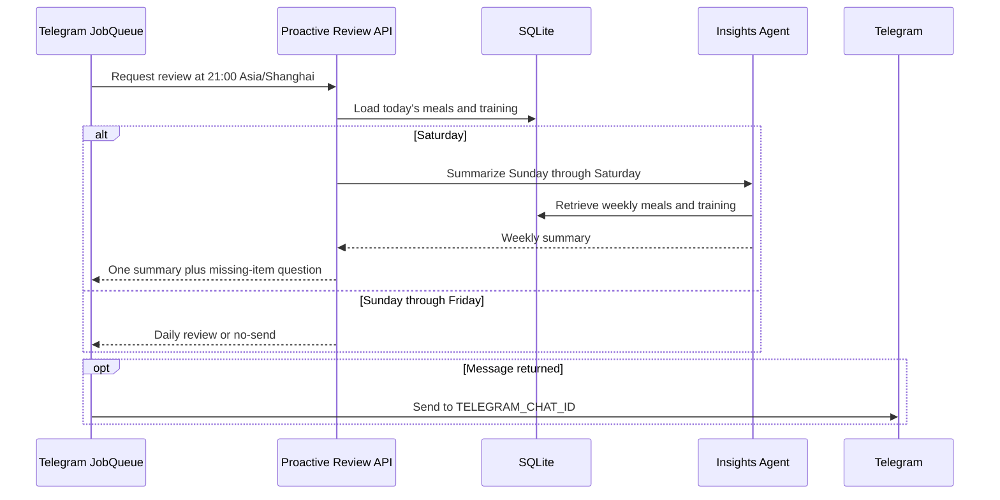

# Proactive Daily and Weekly Reviews Design

## Summary

ChatFit will proactively send one Telegram message at 21:00 Asia/Shanghai each
day. On Sunday through Friday, the message reviews whichever of today's meal
or training data is already recorded and asks only about the missing category.
If both categories are already recorded, ChatFit stays silent. On Saturday,
ChatFit always sends one combined message containing an Insights Agent weekly
summary followed by any question needed to fill gaps in today's records.

This feature remains within the current single-user deployment model. It does
not change user-to-thread mapping, checkpoint identifiers, conversation-memory
retention, or context summarization.

## Goals

- Send a proactive review at 21:00 Asia/Shanghai.
- Avoid asking for information that is already persisted for the current day.
- Ask about training when only meals are present, meals when only training is
  present, and both when neither is present.
- Stay silent on Sunday through Friday when both categories are present.
- On Saturday, use the Insights Agent to summarize the Sunday-through-Saturday
  week and send exactly one combined message.
- Keep record-completeness decisions deterministic and independent of an LLM.
- Preserve the existing Telegram rendering and plain-text fallback behavior.

## Non-goals

- Changing `get_thread_id`, `user_sessions`, checkpoint behavior, or thread
  persistence.
- Limiting Agent context to the most recent 10 messages.
- Supporting multiple notification subscribers or per-user schedules.
- Catching up reminders missed while either service is stopped.
- Adding a durable delivery ledger or exactly-once delivery guarantees.
- Writing proactive summaries or questions into a conversation checkpoint.

## Architecture

The existing Telegram Bot remains the outbound transport and owns the daily
schedule. The FastAPI service remains the owner of business-data access and
Agent execution.

At application startup, the Bot registers one `python-telegram-bot` JobQueue
daily job for 21:00 in `ZoneInfo("Asia/Shanghai")`. The deployment supplies one
`TELEGRAM_CHAT_ID`; startup fails with a clear configuration error when it is
missing or invalid. The scheduled callback asks the API for the day's proactive
review, then sends the returned message to that chat through the existing
Markdown-to-Telegram-HTML renderer with the existing plain-text fallback.

The API exposes a single internal proactive-review operation. It resolves the
current Shanghai calendar date, loads a deterministic daily snapshot, and
returns either a message or an explicit no-send result. On Saturdays, the same
operation also invokes a separately compiled, uncheckpointed Insights Agent.
This direct invocation guarantees Insights routing without changing the
Supervisor or any user thread.

## Components and Responsibilities

### Telegram scheduling and delivery

The Bot owns only these responsibilities:

- validate `TELEGRAM_CHAT_ID`;
- register the daily 21:00 Asia/Shanghai JobQueue task;
- request the already-composed message from the API;
- retry transient API failures a bounded number of times;
- render and send a non-empty response to the configured Telegram chat; and
- log final API or Telegram failures without reporting a false success.

Scheduling requires the `job-queue` extra for `python-telegram-bot`. No new
scheduler process or container is introduced.

### Daily snapshot repository

The SQLite data-access layer will expose date-bounded reads for:

- meal records for one explicit ISO calendar date; and
- training sessions, practices, and sets for one explicit ISO calendar date.

The caller supplies the date. Queries must not derive the boundary from SQLite
UTC `now`. A record counts as present only after it has been successfully
persisted in the existing business tables. Pending Human-in-the-Loop writes do
not suppress a reminder.

### Deterministic daily review service

The Daily Review Service converts the snapshot into a concise Chinese message.
It does not invoke any Agent:

| Persisted today | Sunday-Friday behavior | Saturday suffix |
| --- | --- | --- |
| Neither | Ask what the user ate and trained | Ask both questions |
| Meals only | Briefly recap meals; ask only about training | Ask only about training |
| Training only | Briefly recap training; ask only about meals | Ask only about meals |
| Both | Return no-send | No suffix |

Meal recaps include meal type and a concise item description. Training recaps
include practice names and concise session details already stored in the
database. The service never invents missing quantities or activities.

### Weekly Insights generation

Saturday is defined as the reporting day, and the weekly window is the seven
Shanghai calendar dates from the preceding Sunday through the current Saturday,
inclusive. At 21:00, later Saturday activity is naturally outside the report.

The API directly invokes an uncheckpointed Insights Agent with a request that
requires both weekly training and weekly meal retrieval. Retrieval uses explicit
inclusive start and end dates so the result contains exactly seven calendar
dates and is independent of UTC boundaries. The resulting narrative appears
before the deterministic daily suffix.

The weekly invocation does not call `get_thread_id`, modify `user_sessions`, or
write messages to the existing LangGraph checkpointer.

### Proactive-review API contract

`POST /proactive-review` accepts no request body and returns one typed result
containing:

- `should_send: bool`; and
- `message: str | null`.

For Sunday through Friday, `should_send` is false exactly when both categories
are present. For Saturday, `should_send` is always true because a weekly summary
or an explicit weekly-generation failure notice must be delivered. A true result
must contain a non-blank message; a false result must contain `null`.

The endpoint derives the production date from the application clock. Tests
replace that clock rather than exposing a caller-controlled production date.

## Saturday Composition

Saturday produces one Telegram message, never separate weekly and daily
messages. The order is:

1. weekly heading and Insights Agent narrative;
2. a separator; and
3. the deterministic question for any category missing today.

When both daily categories are present, the third section is omitted. When the
Insights Agent fails after bounded retries, the first section becomes a concise
failure notice directing the user to request the summary manually; the daily
question is still appended when applicable.

## Failure Handling

- A transient Bot-to-API transport error or 5xx response is retried up to three
  total attempts with short, bounded delays. A 4xx response is not retried.
  After the final failure, the Bot logs the error and sends nothing because it
  cannot safely infer record completeness.
- A Saturday Insights invocation is attempted up to two times. If both attempts
  fail, the API returns a weekly failure notice and any applicable daily
  question.
- A Telegram HTML rejection falls back to plain text using the existing delivery
  behavior.
- A final Telegram network failure is logged and not presented as successful.
- A service outage spanning 21:00 is not replayed after restart in this version.
- No delivery ledger is added, so an unavoidable process failure during the send
  boundary can theoretically produce a duplicate or a missed message.

## Configuration and Deployment

`TELEGRAM_CHAT_ID` is required and identifies the sole proactive-message target.
The schedule is fixed at 21:00 Asia/Shanghai for this single-user feature.
`API_PROACTIVE_REVIEW_URL` identifies `POST /proactive-review`; it defaults to
`http://127.0.0.1:${PORT}/proactive-review` and Compose sets it to
`http://api:8000/proactive-review`.

The Bot container does not receive direct access to the business SQLite volume.
All record reads and Agent calls remain inside the API service.

## Observability and Privacy

Operational logs record schedule execution, no-send decisions, retry counts,
and final delivery status without logging meal text, training notes, generated
summaries, or the raw Telegram chat identifier. Existing content-redaction rules
remain in effect for Agent calls.

## Testing

### Data access

- Verify explicit Shanghai dates select only matching meal records.
- Verify explicit Shanghai dates select only matching training sessions and
  their practices/sets.
- Verify an empty category is distinguishable from a populated category.
- Verify the weekly inclusive range contains exactly Sunday through Saturday.

### Daily review service

- Neither category produces both questions.
- Meals only recap meals and ask only about training.
- Training only recaps training and ask only about meals.
- Both categories return the no-send result on Sunday through Friday.
- Recaps contain only persisted values and remain concise.

### Weekly composition

- Saturday directly invokes the Insights Agent with the correct seven-day
  window and both data domains.
- The summary precedes the deterministic missing-item question.
- Both complete categories produce only the weekly summary.
- An Insights failure still produces a failure notice and preserves any daily
  question.
- Exactly one message is returned for every Saturday outcome.

### Bot integration

- The JobQueue registers one daily task for 21:00 Asia/Shanghai.
- Missing or invalid `TELEGRAM_CHAT_ID` fails startup clearly.
- A no-send API result causes no Telegram request.
- A message result is sent only to the configured chat.
- API retries are bounded, and HTML rejection uses the plain-text fallback.
- Existing text, voice, photo, command, and unsupported-input dispatch tests
  remain green.

### Repository verification

The implementation is complete only after an independent verification subagent
runs the repository instructions in `docs/quality.md`, including `make quality`
and the full default test suite, with no error, failure, or warning. Any finding
must be fixed and verification repeated until clean.

## Documentation Changes

- Update `README.md` with `TELEGRAM_CHAT_ID`, the 21:00 Asia/Shanghai behavior,
  Saturday composition, and the no-catch-up limitation.
- Update `docs/architecture.md` to show the Bot scheduler, proactive-review API,
  deterministic review service, and direct Insights Agent call.
- Update `docs/index.html` so the published architecture and configuration do
  not lag behind the code.
- Update `.env.example` with `TELEGRAM_CHAT_ID` and update `docker-compose.yml`
  with `API_PROACTIVE_REVIEW_URL=http://api:8000/proactive-review`.

## Alternatives Considered

### Schedule and send from FastAPI

This keeps the scheduler near the database but makes the API own Telegram token,
proxy, rendering, and transport concerns. It conflicts with the current Bot/API
boundary and was rejected.

### Add a cron job or scheduler container

This isolates scheduling but adds deployment coordination, health checks, and a
third runtime component for one daily job. It is unnecessary for the current
single-user scope and was rejected.

### Let an Agent decide what to ask each day

This can vary the tone but turns deterministic database completeness into an
LLM judgment, increasing cost and the chance of repeated or omitted questions.
The design therefore uses fixed message composition for daily questions and
reserves the Insights Agent for weekly analysis.

## Acceptance Criteria

1. At 21:00 Asia/Shanghai on Sunday through Friday, ChatFit asks only for missing
   categories and remains silent when both are persisted.
2. At 21:00 Asia/Shanghai on Saturday, ChatFit sends exactly one weekly message
   generated through the Insights Agent, with only the applicable daily question
   appended.
3. Date boundaries cover explicit Shanghai calendar dates, and the weekly window
   is exactly Sunday through Saturday inclusive.
4. `TELEGRAM_CHAT_ID` is the only notification target, and an invalid or absent
   value prevents Bot startup with a clear error.
5. No code related to user thread identifiers, checkpoints, or message-retention
   limits changes.
6. Existing Telegram and Agent behavior remains compatible.
7. README, architecture documentation, and `docs/index.html` describe the shipped
   behavior.
8. Independent verification reports no error, failure, or warning.
